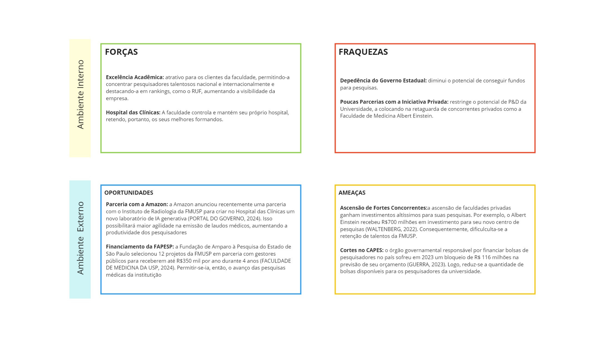
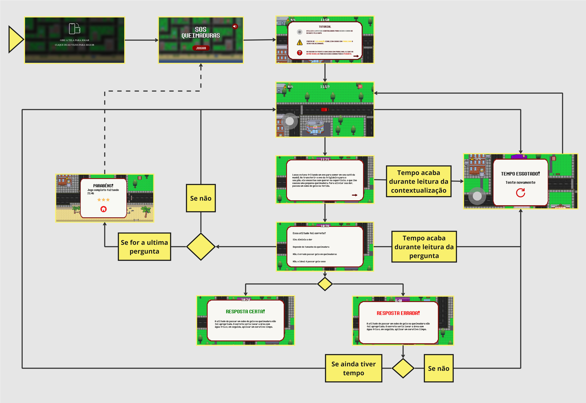
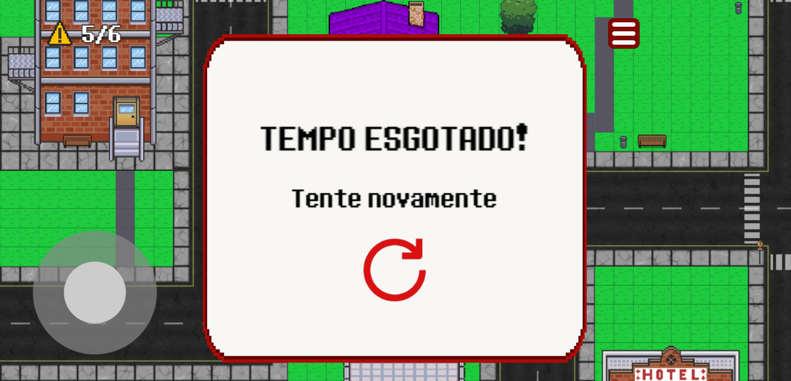

# GDD - Game Design Document - Módulo 1 - Inteli


## TechMed

#### Ana Silva, Anna Giulia, Jonathan Alves, Leonardo Griner, Lucas Nepomuceno, Marcelo Conde Filho, Yanomã Konwski


## Sumário

[1. Introdução](#c1)

[2. Visão Geral do Jogo](#c2)

[3. Game Design](#c3)

[4. Desenvolvimento do jogo](#c4)

[5. Casos de Teste](#c5)

[6. Conclusões e trabalhos futuros](#c6)

[7. Referências](#c7)

[Anexos](#c8)

<br>


# <a name="c1"></a>1. Introdução

## 1.1. Escopo do Projeto

### 1.1.1. Contexto da indústria

&nbsp;&nbsp;&nbsp;&nbsp; O setor de faculdades de medicina no país é um ambiente dinâmico, marcado por uma rivalidade média entre diversas instituições públicas e particulares. Algumas instituições como FMUSP, UNIFESP, UNICAMP e EINSTEIN possuem maior reconhecimento neste mercado e, portanto, procuram se distinguir entre si. O EINSTEIN, por exemplo, investiu recentemente R$700 milhões na construção de um novo centro de pesquisas (WALTENBERG, 2022). Entretanto, essas empresas não podem ser consideradas dominantes neste setor, pois a demanda pela curso e o número de vagas limitado oferece a todas as faculdades uma participação de mercado equilibrada, como é o caso da UFMG que oferece até um número acima da média em vagas (SANT, 2023). <br>
&nbsp;&nbsp;&nbsp;&nbsp; Enquanto a participação das instituições estabelecidas é equilibrada, a entrada de novas faculdades no mercado é limitada por barreiras de entrada significativas, tais como a alta necessidade de capital para criar uma estrutura física. Por exemplo, em 2022, a Cogna teve de investir o valor de R$14,5 milhões para abrir uma nova faculdade de Medicina no Maranhão com apenas 100 vagas anuais (GIMENES, 2022). Além de capital, os requisitos de credenciamento junto ao Ministério da Educação (MEC) para se estabelecer uma faculdade são rigorosos: A Lei nº 9394/1996 exige que as faculdades tenham um terço do corpo docente composto de mestres ou doutores e em tempo integral; é necessário também alvará dos bombeiros e sanitário, licença da prefeitura, avaliação da qualidade de ensino pelo MEC, etc (BRASIL, 1996). Como resultado dessas barreiras, a ameaça de novos entrantes é baixa. <br>
&nbsp;&nbsp;&nbsp;&nbsp; Em relação aos fornecedores da indústria, a complexidade dos equipamentos necessários (ex: Máquina de Radiografia, Tomografia, Arcos Cirúrgicos) torna o poder de barganha dos principais fornecedores alto. Por exemplo, Associação Brasileira da Indústria de Tecnologia para Saúde (ABIMED) conta com apenas 169 empresas, mas já representa 65% do mercado de produtos médico-hospitalares (ASSOCIAÇÃO BRASILEIRA DA INDÚSTRIA DE TECNOLOGIA PARA SAÚDE, [s.d.]). Ademais, apenas a Siemens Healthineers, empresa de produtos hospitalares como máquinas de ultrassom, apresenta 18.000 patentes em todo o mundo, de modo que  concentra o poder de mercado  (SIEMENS HEALTHINEERS, [s.d.]). Portanto, o poder de negociação para com essas empresas se torna quase inviável. <br>
&nbsp;&nbsp;&nbsp;&nbsp; Nesta indústria, os alunos que buscam cursos de medicina são os principais clientes. Dessa forma, faculdades renomadas têm vantagem devido à sua reputação e qualidade reconhecidas, atraindo os melhores candidatos. Evidencia-se, no entanto, que as preferências dos alunos podem variar de acordo com diversos fatores, como localização, oferta de programas acadêmicos e oportunidades de pesquisa e prática clínica, o que influencia suas decisões sobre qual faculdade frequentar. Entretanto, esses alunos raramente têm a possibilidade de negociar o preço já que a medicina é o  curso mais concorrido da maioria dos vestibulares do país (ALVES, 2021). Portanto, o poder de barganha dos clientes é baixo. <br>
&nbsp;&nbsp;&nbsp;&nbsp; Embora alternativas como educação online e simulação médica virtual tenham surgido, as faculdades tradicionais mantêm uma posição segura devido à sua reputação consolidada, recursos físicos substanciais e natureza altamente especializada da formação médica. A interação prática e a experiência clínica oferecidas por essas instituições são  difíceis de serem replicadas fora do ambiente acadêmico e clínico tradicional, garantindo assim sua relevância e competitividade no mercado educacional e médico. Além disso, produtos substitutos como outros cursos de ensino superior têm baixa relevância no caso de Medicina, pois a taxa de desistência é muitissímo baixa. Enquanto que em outros cursos, como Matemática-Licenciatura, a taxa de desistência é de 68%, em Medicina essa taxa desce para 2% (CONSELHO REGIONAL DE MEDICINA DO ESTADO DE SÃO PAULO, 2006; SALDAÑA, 2023). Portanto, a  ameaça de produtos substitutos nessa indústria é baixa.

#### 1.1.1.1. Modelo de 5 Forças de Porter

&nbsp;&nbsp;&nbsp;&nbsp; O modelo de 5 forças de Porter é um framework amplamente utilizada na análise de indústrias. Ele é composto pelos critérios: Rivalidade entre concorrentes, Ameaça de entrada de novos concorrentes, Ameaça de produtos substitutos, Poder de negociação dos clientes e Poder de negociação dos fornecedores. Segundo MAGRETTA (2019), esta é uma ferramenta essencial que objetiva analisar a estrutura do setor para que se compreenda a dinâmica da competição. Para tanto, o modelo avalia a força que cada um dos critérios acima mencionados possuem na competitividade do setor, sendo que, em regra: "quanto mais poderosa a força, mais pressão ela exerce sobre preços ou custos, ou ambos, e, portanto, menos atraente é o setor para os nele estabelecidos." (MAGRETTA, 2019). Conforme apresentado por Magretta (2019) em seu livro "Entendendo Michael Porter: o guia essencial da competição e estratégia", elaborou-se o seguinte Modelo de 5 Forças para o setor de faculdades de medicina:

<div align="center">
<sub>Figura 1 - 5 Forças de Porter</sub>
</div>


<div align="center">
<sup>Fonte: Material produzido pelos autores (2024)</sup>
</div>

&nbsp;&nbsp;&nbsp;&nbsp; Conforme se observa na figura, o Modelo de 5 Forças de Porter apresenta com propriedade os fundamentos econômicos em que se baseia o setor de faculdades de medicina. Vê-se, por exemplo, que os fornecedores possuem "alto poder de barganha" sobre essas faculdades, o que, partindo da regra de Magretta (2019), exerce grande pressão em seus custos. Isto restringe o escopo de ações das faculdades de Medicina, mas cria uma oportunidade para o projeto desenvolvido pelo TechMed-Inteli, pois trata-se de uma parceira gratuita que visa o melhor desempenho da instituição FMUSP em suas campanhas de conscientização contra queimaduras. Portanto, a TechMed-Inteli se diferencia dos outros fornecedores da instituição.

### 1.1.2. Análise SWOT

&nbsp;&nbsp;&nbsp;&nbsp; A Análise SWOT é uma ferramenta de negócios que visa dar uma perspectiva multifatorial de uma empresa, comprimindo 4 categorias: Forças, Fraquezas, Oportunidades e Ameaças (CASAROTTO, 2019). As duas primeiras (Forças e Fraquezas), concernem ao ambiente interno da empresa, como localização, qualidade de atendimento, capital, etc (CASAROTTO, 2019). Já as duas últimas (Oportunidades e Ameaças), concernem ao ambiente externo da empresa, como cenário macroeconômico (câmbio, inflação, etc) e microecônomico (crenças e valores, concorrentes, etc) (CASAROTTO, 2019). Neste caso, a empresa tem pleno controle sobre os fatores do ambiente interno (Forças e Fraquezas), porém isto não ocorre no ambiente externo (Oportunidades e Ameaças). Conforme este modelo, apresentado por Cassaroto (2019), a TechMed elaborou uma Análise SWOT para a FMUSP:

<div align="center">
<sub>Figura 2 - Análise SWOT </sub>
</div>




<div align="center">
<sup>Fonte: Material produzido pelos autores (2024)</sup>
</div>

&nbsp;&nbsp;&nbsp;&nbsp; Conforme se vê na figura acima, a Análise SWOT nos permite conhecer melhor as forças e fraquezas do nosso parceiro. Dessa forma, alinha-se as expectativas da TechMed em relação às exigências e pedidos que são viáveis à FMUSP. Além disso, a análise de Oportunidades e Fraquezas especificamente, contribuiu para o entuasiasmo do grupo em agir em prol do sucesso da instituição no contexto atual.

### 1.1.3. Descrição da Solução Desenvolvida

&nbsp;&nbsp;&nbsp;&nbsp; No dia 09/02/2024, a Faculdade de Medicina da Universidade de São Paulo (FMUSP) relatou aos membros da TechMed sua tarefa de conscientizar jovens de escola pública acerca da prevenção de queimaduras. Segundo os colaboradores, isso era conduzido por meio de palestras cujo conteúdo desmitificativa cuidados de primeiros socorros no caso de queimaduras, explicavam acerca do modo correto de prosseguir nessas situações de risco e como se prevenir delas. Entretanto, a didática puramente teórica do conteúdo dificultava a retenção de conhecimento dos alunos bem como seu tempo de atenção. <br>
&nbsp;&nbsp;&nbsp;&nbsp; Consequentemente, as palestras não surtiam o efeito desejado de prevenir a ocorrência e o agravamento dos casos de queimadura.  Além disso, o cliente não possuía recursos educacionais especialmente preparados para atender sua demanda de modo que se utilizara de ferramentas generalistas como o Kahoot! Assim, viu-se, parceria com a Techmed-Inteli, a oportunidade de não apenas aliviar essas dores, como também conseguir ganhos adicionais como a aplicação da tecnologia no contexto médico que cria um diferencial para as iniciativas educativas da instituição. <br>
&nbsp;&nbsp;&nbsp;&nbsp; Desse relato e do levantamento de ideias em grupo durante as semanas subsequentes, desenvolveu-se a proposta de solução da TechMed. a qual leva à práticas inadequadas de prevenção e tratamento. Esta visa disseminar informações precisas acerca de queimaduras, desmistificar pré-concepções de tratamentos inadequados e/ou prejudiciais e capacitar a população para lidar e prevenir esses acidentes, potencialmente reduzindo o número de casos, de modo emocionante e acessível. <br>
&nbsp;&nbsp;&nbsp;&nbsp; Para isso, a TechMed propôs o desenvolvimento de um jogo de celular que mistura aspectos educativos com o gênero de corrida/competitividade por tempo. Visa-se dessa forma estimular nos alunos a competitividade característica do tipo de diversão de "Desafio" o qual foi catalogado pelo educador e designer de games Marc LeBlanc (ARRIVABENE, 2020 apud LEBLANC, 2004). Ademais, espera-se maior acessibilidade do nosso jogo, visto que cerca de 92 milhões da população brasileira tem acesso à internet somente pelo celular (PORTO, 2023). <br>
&nbsp;&nbsp;&nbsp;&nbsp; Em "S.O.S Queimaduras", o jogo a ser desenvolvido pela TechMed, o usuário controla uma unidade de resgate dos bombeiros e deve atender residências que precisam da sua ajuda no mapa. As casas estão sinalizadas com um ponto de exclamação e correspondem a perguntas realistas de situações de risco de queimaduras ou do ato de queimar-se em si. Então, o jogador tem X minutos para terminar de responder todas as 12 zonas de interação. A depender do tempo de completude das duas fases existentes no jogo, o usuário receberá até 3 estrelas que a TechMed acredita ser indicativo de dois dados: seu grau de conhecimento acerca da prevenção de queimadura e o seu empoderamento desse conhecimento, pois, parte-se do princípio que quanto melhor consolidado está o conhecimento, mais eficiente é sua atuação na prática. <br>
&nbsp;&nbsp;&nbsp;&nbsp; Além de reuniões constantes de validação, para trabalhar nesse projeto, foi necessário o uso de materiais teóricos e ferramentas de desenvolvimento de jogos. A FMUSP nos disponibilizou os quatro seguintes materiais: o Manual de Queimaduras para Estudantes, a Cartilha para Tratamento de Emergência das Queimaduras, a Apresentação do Projeto Burn Game e o "Kahoot!" que eles usavam em suas palestras sobre o tema; os quais nos guiaram na elaboração de perguntas para o jogo e a adequação de temática/cenário. Já em relação às ferramentas tecnológicas, utilizamos-nos dos softwares: Canvas, VisualStudio, Pixiliart, Piskel e Pixabay; e das linguagens Javascript e HTML, integradas ao Phaser. <br>
&nbsp;&nbsp;&nbsp;&nbsp; Espera-se, do resultado do acúmulo desse conhecimento somado as habilidades de programação, design e documentação dos desenvolvedores da TechMed, ainda um ganho adicional: a possibilidade de atingir com o S.O.S Queimaduras um público além das palestras conduzidas pela FMUSP. Para tanto, prepará-lo-emos para sua disponibilização em algum website pertencente a faculdade. Deste modo, o jogo poderá ser disponibilizado ao público em geral, alcançando um número ainda maior de pessoas.

### 1.1.4. Proposta de Valor 
&nbsp;&nbsp;&nbsp;&nbsp; Value proposition canvas, ou canvas de proposta de valor, é uma ferramenta de análise de público consumidor, segundo "Kellison Ferreira". Dividida em dois blocos principais - o Perfil do Cliente e o Mapa de Valor - ela permite uma visualização clara dos segmentos de clientes, suas dores, ganhos desejados, e como os produtos ou serviços oferecidos pela empresa aliviam essas dores e criam ganhos. Essa abordagem estruturada facilita a compreensão das necessidades do cliente e o alinhamento das ofertas da empresa, resultando em uma proposta de valor única e atraente no mercado. A partir destes conceitos, foi feita o Canvas de proposta de valor, que pode ser observado na imagem abaixo. <br>

<div align="center">

<sub> Figura 3 - Value Proposition Canvas </sub>


<sup>Fonte: Material produzido pelos autores (2024)</sup>
</div>

&nbsp;&nbsp;&nbsp;&nbsp;A partir da imagem acima, foram analisados todos os elementos relacionados e, assim, desenvolveu-se uma proposta que se destaca pela abordagem no que tange as queimaduras, por meio de um conteúdo informacional aplicado de forma dinâmica e descontraída, buscando engajar os jovens e disseminar práticas adequadas de prevenção e remediação das queimaduras. Ao incorporar esse recurso lúdico ao ensino sobre queimaduras, busca-se não apenas educar, mas também entreter o público-alvo, aumentando assim a eficácia da mensagem. Na imagem abaixo pode ser observadado a proposta de valor feita a partir das informações coletadas sobre o cliente. <br>
&nbsp;&nbsp;&nbsp;&nbsp;Desta forma, o produto criado agrega valor ao usuário final ao conseguir transmitir um contato agradável e envolto, de forma cômica e lúdica, mas dentro de um balanço entre sério e divertido, o jogador consegue ter contato com uma mecânica de jogo, ao controlar o personagem e realizar escolhas nas ocorrências, além de ter também o contato com um jogo de perguntas e respostas, que colaboram para um aprendizado enxuto e completo sobre queimaduras. <br>


### 1.1.5. Matriz de Riscos

&nbsp;&nbsp;&nbsp;&nbsp; Durante a produção de projetos, é comum enfrentar desafios tanto internos, provenientes da própria equipe, quanto externos, decorrentes de fatores fora do controle direto do grupo, os quais podem impactar a entrega do produto final com a qualidade desejada. Para lidar com essas eventualidades, é essencial empregar ferramentas de gestão, como a Matriz de Riscos. <br>
&nbsp;&nbsp;&nbsp;&nbsp; A Matriz de Riscos é uma ferramenta que visa identificar, avaliar e priorizar os riscos associados a um projeto (TOMAZ et al., 2020; NAPOLEÃO, 2019). Geralmente, ela é representada por uma tabela dividida em linhas e colunas. As linhas podem representar o impacto que o problema causará na execução do projeto, enquanto as colunas representam a probabilidade de ocorrência desses eventos (NAPOLEÃO, 2019). A probabilidade é geralmente classificada em uma escala de baixa a alta, indicando a chance de o evento ocorrer, enquanto o impacto é classificado de acordo com a severidade das consequências caso o evento se concretize (TOMAZ et al., 2020; NAPOLEÃO, 2019). Por essa razão, a TechMed na função de viabilizar um projeto confiável e eficiente, elaborou a matriz de risco que se segue <br>

<div align="center">
<sub> Figura 4 - Matriz de Riscos </sub>
  


<sup>Fonte: Material produzido pelos autores (2024)</sup>
</div>
<br>

&nbsp;&nbsp;&nbsp;&nbsp; A Matriz de Risco apresentada na figura acima representa os riscos da última iteração do time da TechMed. Evidencia-se que a coloração atríbuida em cada espaço da Matriz se refere a gravidade do risco, sendo que verde é um risco baixo, amarelo um risco médio e vermelho um risco alto. Considerando isso, observa-se que poucos riscos eram considerados altos (apenas dois). De fato, neste momento, os riscos não eram graves nem numerosos e se ligavam principalmente ao resultado do projeto, como "Jogo não cumprir a função de educar e ajudar na prevenção", ou à apresentação do produto em si durante o Pitch para o parceiro, como "A apresentação do produto não ser convicente". Não obstante isso, esses riscos devem ser monitorados atentamente, pois concernem à entrega do projeto. <br>
&nbsp;&nbsp;&nbsp;&nbsp; Para tanto, é fundamental desenvolver um plano de ação para mitigá-los. Este plano de ação inclui uma série de medidas que visam reduzir a probabilidade de ocorrência do risco, minimizar seu impacto ou preparar o time para lidar com ele caso aconteça. Pensando nisso, a TechMed desenvolveu um plano de ação. Este, será aplicado e revisado durante a execução do projeto, visando o melhor desempenho da nossa solução e a satisfação do parceiro. O quadro abaixo se trata do plano de ação elaborado pela TechMed:
<br>

<div align="center">
<sub>Quadro 1 - Plano de Ação</sub>
</div>
  
Risco | Plano de Ação  
--- | ---
Membros se sentirem nervosos na apresentação do produto| Praticar a apresentação repetidamente.
Conflitos dentro da equipe| Buscar o orientador para entender o melhor caminho; Analisar o motivo da desavença e buscar um caminho para resolver; Criar regras de conduta; Buscar resolver todo pequeno conflito inicialmente; Desenvolver uma comunicação clara e não violenta.
Apresentação do produto não ser convincente| Refinar e melhorar o conteúdo da apresentação; realizar treinamentos; coletar feedbacks.
Jogo não ser divertido para o usuário| Realizar testes com o público alvo e coletar feedbacks.
Problemas no que tange a responsividade do jogo| Procurar ajuda com professores e monitores; 
Não conseguir finalizar o projeto a tempo| Estipular prazos; Criar metas específicas para determinada atividade; Utilizar o método de divisão e conquista, pegando o projeto e dividir em pequenos problemas para facilitar suas resoluções.
Perda de arquivos importantes| Realizar backups a cada nova atualização.
Jogo não cumprir sua função de educar e ajudar na prevenção| Apresentar os materiais do jogo para que os clientes, que são especialistas, possam avaliar.

<div align="center">
<sup>Fonte: Material produzido pelos autores (2024)</sup>
</div>
<br>

&nbsp;&nbsp;&nbsp;&nbsp; Conforme se observa na tabela acima, o plano de ação deve ser preciso em suas demandas para que auxilie o grupo no processo de combate aos riscos do projeto. É de extrema importância que se estabeleçam ações claras como "realizar backups a cada nova atualização" ao invés de "tomar cuidado" em relação a perda de arquivos, caso objetivesse o sucesso do plano e a mitigação dos riscos <br>
&nbsp;&nbsp;&nbsp;&nbsp; Evidencia-se, porém, que circunstâncias externas ou repetinas não apenas são compostas de consequências negativas. Por essa razão, elabora-se a Matriz de Oportunidades. Trata-se de uma ferramenta semelhante, porém focada em identificar e maximizar os aspectos positivos que podem ocorrer durante a execução do projeto. Ela pode ser utilizada para identificar oportunidades de melhoria, ganhos adicionais ou benefícios inesperados que possam surgir ao longo do processo (NAPOLEÃO, 2019). <br>
&nbsp;&nbsp;&nbsp;&nbsp; Dessa forma, tanto a matriz de riscos quanto a matriz de oportunidades são ferramentas valiosas de gestão de projetos que permitem aos gestores identificar e responder de forma proativa aos riscos potenciais e oportunidades de melhoria, contribuindo para o sucesso do projeto. <br>
&nbsp;&nbsp;&nbsp;&nbsp;  Ademais, para o melhor uso das ferramentas de gestão, elaborou-se uma Matriz de Oportunidades. Esta, permitiu à equipe uma visão ampla sobre o impacto do projeto e seus potenciais benefícios, o que motivou os integrantes a se dedicar ao desenvolvimento e a impusionar as oportunidades.Sendo assim, o grupo TechMed elaborou a matriz de riscos que pode ser observada na imagem a baixo. <br>

<br>
<div align="center">
<sub> Figura 5 - Matriz de Oportunidades </sub>
  


<sup>Fonte: Material produzido pelos autores (2024)</sup>
</div>

&nbsp;&nbsp;&nbsp;&nbsp; A partir da imagem acima, na qual foi aplicada o conceito desta importante ferramenta, foi possível observar as oportunidades que poderiam ser perguidas pelo grupo durante a execução do projeto. Ademais, este mecanimo serve como forma de antecipar os riscos de modo a mitigá-los ou monitorá-los a depender do plano de ação elaborado. <br>

## 1.2. Requisitos do Projeto

&nbsp;&nbsp;&nbsp;&nbsp; Nesta seção, abordaremos os requisitos do projeto. Estes advém, normalmente, de pedidos do parceiro em relação ao projeto. Além disso, consta no requisitos, as inovações e invenções do próprio grupo que agregam valor ao projeto. Desta forma, foram enumerados os seguintes requisitos abaixo. <br>

<div align="center">
<sub>Quadro 2 - Requisitos do Projeto</sub>
</div>

\# | Requisito  
--- | ---
1 | O controle do personagem será realizado usando um joystick
2 | O personagem ganha tempo toda vez que resolver um desafio corretamente
3 | O jogo deve possuir uma tela de abertura para o jogador escolher opções de som e início
4 | O jogo deve ter suporte web
5 | A pontuação do jogo deve ser basear no tempo que o jogador levou para completar o jogo
6 | A pontuação do jogo será feita em formato de estrelas (máx 3)
7 | O jogador deve se mover apenas entre as ruas
8 | Os desafios do jogo terão forma de pergunta, com duas ou quatro opções de resposta
9 | O jogo deve ter casas com desafios que serão queimadas caso o jogador não acerte a resposta do desafio
10 | O jogo deve ter uma trilha sonora de fundo
11 | O cenário do jogo deve ser uma cidade "vista de cima"
12 | Uma tela de finalização deve aparecer, assim que o último desafio for resolvido, constando objetivamente: em quanto tempo o jogador completou o jogo e a quantidade de estrelas que recebeu
13 | As perguntas presentes no jogo deve ser dos tópicos Prevenir Queimaduras ou Remediar Queimaduras
14 | No feedback da resposta do jogado ao desafio, deverá haver uma explicação detalhada do motivo das respostas estarem certas ou erradas.
15 | Deverão ser abordadas assuntos abrangentes o suficiente para permitir um ciclo de jogo de 12 minutos
16 | Abordagem com maior foco em prevenção
17 | O jogo deve ter, no mínimo, 10 efeitos sonoros
18 | A pontuação do jogo deve se basear no tempo
19 | A consequência do erro do usuário deve ser maior do que a consequência do acerto
20 | Deve haver uma quantidade de miníma de tempo na tela de feedback para obrigar o usuário a ler a explicação
21 | No HUD do jogo devem constar: Quantidade de zonas de interação concluídos, quantidade de tempo restante e menu
22 | O jogo deve ter uma tela final que dá a chance do jogador tentar novamente, caso o tempo acabe

<div align="center">
<sup>Fonte: Material produzido pelos autores (2024)</sup>
</div>

<br>
&nbsp;&nbsp;&nbsp;&nbsp; A partir do que foi destacado acima, foi possível alinhar os requisitos do cliente e assim realizar o projeto, de forma que as ideias não fujam do que foi requerido pelo cliente. O que evita gastos de energia com mudanças de rotas no projeto, caso estes não fossem seguidos.


## 1.3. Público-alvo do Projeto

&nbsp;&nbsp;&nbsp;&nbsp; Ao longo dos encontros com a equipe da FMUSP, pode-se traçar o perfil do usuário com base na experiência dos clientes. Sabe-se que a instituição realiza palestras de conscientização para o público do ensino médio. Desta forma, fica claro que o foco é voltado aos adolescentes brasileiros, em especial, adolescentes que tiveram contato de alguma forma com o conteúdo sobre queimaduras. Além disso, evidencia-se o perfil socioeconômico deste público, que se encaixa, geralmente nas classes D e E, dado que as palestras são realizadas em escolas públicas. Portanto, constroe-se as características do jogo, tais como, em que plataforma o jogo rodará, com base nesse perfil. Essas características são abordadas nas subseções deste capítulo.

# <a name="c2"></a>2. Visão Geral do Jogo

## 2.1. Objetivos do Jogo

&nbsp;&nbsp;&nbsp;&nbsp; Este jogo tem como principal tipo de diversão o desafio. Nele, o jogador deve responder o maior número de casos no menor tempo possível. Para isso, o usuário deverá responder corretamente 18 perguntas, sendo estas: 6 no nível Fácil e 6 conjuntos de duas perguntas que constituem o Nível Difícil. <br>
&nbsp;&nbsp;&nbsp;&nbsp; Para tanto, o jogador controlará uma  Unidade de Resgate (veículo do corpo de bombeiros destinado ao atendimento pré-hospitalar das vítimas) e percorrer o mapa disponível, identificando e chegando até espaços sinalizados onde acessarão as perguntas. 

## 2.2. Características do Jogo

### 2.2.1. Gênero do Jogo

&nbsp;&nbsp;&nbsp;&nbsp; Trata-se de um jogo educacional, implementado à uma mecânica de corrida, pois o tempo e a acuracidade das respostas é relevante para o sucesso do jogador.  Intenta-se, por meio disso, fazer um trabalho de conscientização sobre queimaduras que seja desafiador e divertido. Desta forma, o formato usado atinge o objetivo principal do projeto, educando e informando os usuários sobre as queimaduras. 

### 2.2.2. Plataforma do Jogo

&nbsp;&nbsp;&nbsp;&nbsp; Trata-se de um jogo para _smartphones_ que rodará em uma página _web_. O foco em aparelhos celulares, deve-se à acessibilidade como meta principal, uma vez que cerca de 92 milhões da população brasileira tem acesso à internet somente pelo celular, como aponta pesquisa do TIC Domicílios realizada em 2022, especialmente as Classes D e E (PORTO, 2023).

### 2.2.3. Número de jogadores

&nbsp;&nbsp;&nbsp;&nbsp; Por ser um jogo educacional focado no aprendizado, foi definido que o jogo será jogado somente por uma pessoa em rede local. Desta forma, visa-se aprimorar o aprendizado individual dos usuários em detrimento da competitividade. Uma vez que, caso fosse multiplayer, os jogadores optariam por priorizar a velocidade com que o jogo é concluído.  

### 2.2.4. Títulos semelhantes e inspirações

&nbsp;&nbsp;&nbsp;&nbsp; O projeto foi inspirado principalmente no jogo Polly Party Pickup. Neste jogo, o jogador é o carro da Polly e deve cumprir uma série de missões na cidade, indo à diferentes lugares. O projeto segue esta a mesma dinâmica: o jogador deverá percorrer a cidade em busca dos locais com emergência. Além disso, o jogo Fogo e Água nos inspirou em seu formato de pontuação. Esta, a qual é baseada em estrelas e dependente do tempo decorrido para completar uma fase, será o modelo adotado no jogo.

### 2.2.5. Tempo estimado de jogo

&nbsp;&nbsp;&nbsp;&nbsp; O tempo estimado para a conclusão do jogo é de 12 minutos.

# <a name="c3"></a>3. Game Design

## 3.1. Enredo do Jogo

&nbsp;&nbsp;&nbsp;&nbsp; Na história do jogo, o usuário representa uma Unidade de Resgate que aconselha pessoas comuns nos diferentes locais da cidade. Durante 12 minutos, o bombeiro atenderá 12 chamados que correspondem à 18 perguntas no total e remetem à situação-problemas relacionados à prevenção de queimaduras. O papel do bombeiro é atender os chamados corretamente para que nenhuma das zonas de interação pegue fogo.

## 3.2. Personagens

### 3.2.1. Controláveis

&nbsp;&nbsp;&nbsp;&nbsp; No jogo não foram utilizados personagens antromórficos. Apesar disso, o jogador é capaz de controlar uma unidade dos bombeiros que será seu controlável principal. Isso foi escolhido para atender à mecânica e os objetivos do jogo, os quais se relacionam a possibilidade de percorrer rapidamente uma cidade, visando atender à chamados de emergências.
Além disso, a não utilização de pessoas como personagens contribui para a imersão no game e a mitiga o problema da representatividade. Neste caso, qualquer jogador pode se identificar com o jogo. Sendo assim, foi feito o seguinte controlável que pode ser observado na imagem abaixo. <br>

<div align="center">
<sub> Figura 6 -  Unidade de resgate </sub>


<sup>Fonte: Material produzido pelos autores (2024)</sup>
</div>

### 3.2.2. Diversidade e Representatividade dos Personagens

&nbsp;&nbsp;&nbsp;&nbsp; Não obstante a não utilização de personagens antropormóficos, os nomes utilizados nas situações-problemas representam e atendem à realidade do público alvo. Nomes comuns no Brasil como: Seu Zé, Lucas, Ana, etc; foram utilizados nas pequenas narrativas que antecedem as perguntas. Além disso, utilizou-se de nomes indígenas - que apesar de importantes, apresentam baixos índices de representatividade na população urbana brasileira. <br>
&nbsp;&nbsp;&nbsp;&nbsp; Ademais, tratou-se do tema da diversidade do jogo ao dedicar uma cena do jogo, prévia ao início, a um tutorial que explica detalhadamente como os recursos do celular (touch e drag) e as sinalizações do mapa podem ser úteis em jogo. Desta forma, incluiu-se efetivamente a parte do público alvo intelectualmente deficiente e a parte que nunca teve acesso a esse tipo de aparelho.

## 3.3. Mundo do jogo

### 3.3.1. Locações Principais e/ou Mapas
&nbsp;&nbsp;&nbsp;&nbsp; Primeiramente, tem-se o mapa que está localizado na imgagem abaixo, sendo inspirado em um subúrbio. Neste que há diversas casas diferentes, hotéis, lojas de conveniência, etc. Há também uma praia, a qual é parte do conjunto de zonas de interação com o jogador, trazendo assim diversidade nos possíveis cenários de queimaduras, uma vez que podem acontecer em diversos locais. Desta forma, durante a partida, o jogador terá interação com doze áreas localizadas a frente dos imóveis e da praia. 

<br>
<div align="center">
<sub> Figura 7-  Mapa do jogo </sub>


<sup>Fonte: Material produzido pelos autores (2024)</sup>
</div>
<br>

&nbsp;&nbsp;&nbsp;&nbsp; Outro ponto é que o jogo é dividido em duas fases, sendo a primeira constituída por seis perguntas. Após responder às perguntas, ocorre uma transição para a segunda fase, na qual há o marco para surgir seis novas zonas de interação. Sendo assim, na imagem abaixo, é apresentada essa transição que marca a divisão entre as duas fases, sendo uma forma de inspirar e celebrar uma conquista, incentivando os usuários a continuarem empenhados dentro do jogo. 
<br>
<div align="center">
<sub> Figura 8 -  Mapa do jogo </sub>


<sup>Fonte: Material produzido pelos autores (2024)</sup>
</div>
<br>
&nbsp;&nbsp;&nbsp;&nbsp;Sendo assim, as imagens acima representam as locações principais do jogo "SOS Queimaduras". Sendo essas fundamentais para dinâmica de jogo, uma vez que é dentro de mapa que as interações do usuário com o jogo ocorrem, além da segunda fase fundamental para marcar uma mudança na dinâmica, uma vez que cada casa passa a ter duas perguntas, trazendo uma nova mudança que gera sentimentos de desafio dentro de jogo. <br>


### 3.3.2. Navegação pelo mundo
&nbsp;&nbsp;&nbsp;&nbsp; A navegação pelo mundo é muito importante quando o assunto é a experiência do usuário dentro do jogo. Esta deve ser lógica e acessível, a fim de que o jogador consiga interagir com as mecânicas e cenários sem dificuldades maiores que o esperado, o que acarreta no aumento de foco, tempo de jogo e aprendizado. <br>
1. A primeira tela é a de início, onde haverá um botão escrito "jogar", ao apertar ele, o jogador será direcionado para um tutorial explicativo;
2. No tutorial terá informações sobre o jogo, a fim de explicar as mecânicas principais. Após ler, o jogador clica no (x) no canto superior direito. Deste modo, será redicirecionado ao mapa principal;
3. No cenário principal, jogador poderá mover o veículo a partir do uso do joystick, podendo se locomover em todas direções e sentidos. Assim, ele poderá chegar em frente às casas;
4. Ao posicionar-se em frente às casas, dentro da área de interação, um botão de interrogação surge no canto inferior direito, o qual deverá ser pressionado para acessar as perguntas;
5. Em seguida, abrirá uma tela mostrando um enredo, a pergunta e suas possíveis respostas; <br>
   5.1 Caso o usuário erre, ele terá acesso a resposta correta e sua explicação,<br>
   5.2 Caso o usuário acerte, receberá os parabéns e a explicação; <br>
6. Ao fim do tempo de jogo ou fim das 18 perguntas, o usuário é redirecionado a tela de fim de jogo<br>
   6.1 Fim do tempo: haverá um botão para reiniciar o jogo,<br>
   6.2 Todas as perguntas respondidas: haverá um botão de reiniciar o jogo e a pontuação, representada por estrelas.

### 3.3.3. Condições temporais

&nbsp;&nbsp;&nbsp;&nbsp; No jogo, o tempo é crucial. Ele define toda a ação e, em última análise, o tipo de diversão que integra a estética principal. Em primeiro momento, o temporizador apresenta 12 minutos de gameplay. A cada erro do jogador, o tempo é diminuido em 3 minutos e a cada pergunta que acerta, o tempo é aumentado em 30 segundos. Ao fim dos 12 minutos (incrementado ou decrementado), o jogo acaba e dá a possibilidade de o jogador reinicía-lo. <br>
&nbsp;&nbsp;&nbsp;&nbsp; No entanto, adiciona-se às condições temporais, a pontuação do jogo. É baseado nele que a pontuação do jogador é definida, de modo a estimular uma gameplay mais desafiante e divertida. Explicita-se isso na cena de nosso tutorial representada na Figura 17 e disposta da seguinte forma com relação ao tempo que sobra no cronômetro:
- 1 Estrelas: Menor ou igual à 4 minutos;
- 2 Estrelas: Menor que 8 minutos e maior que 4 minutos;
- 3 Estrelas: Maior ou igual à 8 minutos


### 3.3.4. Concept Art

&nbsp;&nbsp;&nbsp;&nbsp; _Concept art_, ou arte conceitual, consiste em um esboço de ideias iniciais, isto é, uma representação visual dos elementos de um filme, jogo ou animação. Assim, o recurso é utilizado principalmente para a apresentação de cenários, personagens e criaturas, tendo como objetivo não apenas retratar como será cada componente, mas também expressar sua função dentro do enredo. <br>
&nbsp;&nbsp;&nbsp;&nbsp; Embora muito confundido com o termo ilustração, _concept art_ não se trata do produto final, mas de um rascunho emblemático dos principais elementos presentes na história contada. Já a ilustração, é produzida para ser o próprio resultado.<br>
&nbsp;&nbsp;&nbsp;&nbsp; Dessa forma, durante o desenvolvimento do Jogo de Queimadura, foram feitas _concept arts_ das possíveis cenas que seriam confeccionadas, as quais sofreram alterações com o passar do tempo. Entre elas estão:


<div align="center">
<sub> Figura 9 -  Concept Art: Unidade de resgate </sub>
  


<sup>Fonte: Material produzido pelos autores (2024)</sup>
</div>
Legenda: A concept art ilustra uma ambulância indo a um ponto de emergência, ideia que inspirou a aplicação de um carro de resgate como o controlável do jogo. <br>

<div align="center">
<sub> Figura 10 -  Concept Art: Agente de Saúde </sub>
  


<sup>Fonte: Material produzido pelos autores (2024)</sup>
</div>
Legenda: A concept art representa uma animação, em que mostraria um profissional da saúde indo até uma casa, onde há alguém que precisa de ajuda. Posteriormente, a ideia foi aplicada, porém sem mostrar a ida do profissional ao local. <br>

<div align="center">
<sub> Figura 11 -  Concept Art: Tela de perguntas </sub>
  


<sup>Fonte: Material produzido pelos autores (2024)</sup>
</div>
Legenda: Esboço de uma tela de quiz (perguntas com objetivo de testar e avaliar conhecimentos), ideia aplicada com foco em questões sobre a prevenção de queimaduras, se tornando a maneira como o jogo atinge seu objetivo de conscientizar a população.
<br>

&nbsp;&nbsp;&nbsp;&nbsp; Essas _concept arts_ são apenas esboços iniciais da ideia do jogo, as quais misturadas deram vida ao jogo que estamos criando.

### 3.3.5. Trilha sonora

Abaixo é possível verificar a trilha sonora e os efeitos sonoros do Jogo de Queimadura

<div align="center">
<sub>Quadro 3 - Trilha Sonora</sub>
</div>

\# | titulo | ocorrência | autoria
--- | --- | --- | ---
1 | Easy Arcade | Todas as telas | Pixabay
2 | Clique | Quando clicar em um botão | Própria
3 | powerUpRelogio | Quando coletar um relógio do mapa | Pixabay
4 | perguntaAcerto| Quando acertar uma pergunta | Pixabay
5 | perguntaErro | Quando errar uma pergunta | Pixabay
6 | bloop_menu | Quando abrir o menu | Pixabay
7 | bloopInvertido_menu | Quando sair do menu | Pixabay
8 | clickSom | Quando clica no botão escrito “jogar” ou no “x” para sair de perguntas ou do tutorial| Pixabay
9 | carroMotor | Quando iniciar o jogo | Pixabay
10| colisao | Quando o veículo colidir com as delimitações da rua | Pixabay
11| vitoriaFinal | Quando ganhar o jogo | Pixabay
12| perdaFinal | Quando perder o jogo | Pixabay
13| zonaAtiva | Quando o veículo entra na zona de interação | Pixabay

<div align="center">
<sup>Fonte: Material produzido pelos autores (2024)</sup>
</div>

## 3.4. Inventário e Bestiário

### 3.4.1. Inventário

&nbsp;&nbsp;&nbsp;&nbsp; Abaixo, apresenta-se o único item do jogo. Esse tem um papel crucial para o cálculo da pontuação do jogador.

<div align="center">
<sub>Quadro 4 - Inventário do jogo</sub>
</div>

\# | item |  | como obter | função | efeito sonoro
--- | --- | --- | --- | --- | ---
1 | Relógio |  | há três espalhadas pelo mapa | aumenta o tempo disponível do jogador no temporizador | som de relógio correndo

<div align="center">
<sup>Fonte: Material produzido pelos autores (2024)</sup>
</div>

### 3.4.2. Bestiário

&nbsp;&nbsp;&nbsp;&nbsp; Foi considerada a inclusão de uma personagem idosa no bestiário do jogo, uma senhora que dissemina informações falsas, representando os mitos clássicos frequentemente compartilhados por pessoas mais velhas, como as avós. Desta forma, diferentes senhoras estariam espalhadas pelo mapa, oferecendo informações incorretas para confundir o jogador.

&nbsp;&nbsp;&nbsp;&nbsp; No entanto, desde o início do desenvolvimento do jogo SOS Queimaduras, o objetivo principal tem sido criar uma dinâmica divertida através do gerenciamento do tempo, e fornecer informações relevantes mediante perguntas baseadas em cenários clássicos de risco. Adicionar um bestiário poderia desviar o jogo de seu propósito real e seu objetivo inicial: ensinar de forma divertida sobre queimaduras.

&nbsp;&nbsp;&nbsp;&nbsp; Portanto, a equipe TechMed decidiu que personagens como a senhora desinformada, ou qualquer outro elemento no bestiário, estariam fora do escopo do Mínimo Produto Viável (MVP) para o nosso projeto, garantindo assim a ausência de inimigos para o jogador.


## 3.5. Gameflow (Diagrama de cenas)

&nbsp;&nbsp;&nbsp;&nbsp;No cenário em que uma equipe produz um jogo desde seu início, fatores como a dispersão das ideias ou olhares diferentes sobre o mesmo objetivo podem atrapalhar a realização do projeto. Por isso, dentro do planejamento de um jogo há diversas etapas essenciais para orientar os desenvolvedores – programadores ou não – a construir a lógica por trás do produto. Um desses métodos de orientação é o gameflow, também conhecido como diagrama de cenas, é responsável por detalhar o fluxo que o jogo tomará a partir da perspectiva do jogador, apontando todas as possíveis direções tomadas por ele. <br>
&nbsp;&nbsp;&nbsp;&nbsp; O gameflow é importante para ampliar a análise de níveis e de possibilidades a serem exploradas. Esse método é composto por um diagrama contendo as cenas que o jogador passará ao decorrer do jogo, com setas indicando as próximas. Para a melhor exemplificação do jogo, torna-se necessário adicionar tabelas UML apontando os as classes, os métodos e os atributos –  importantes elementos no código do jogo  – de cada ponto apresentado no diagrama. Este que pode ser observado na imagem abaixo.
<br>

<div align="center">

<sub> Figura 12 - Diagrama de Cenas </sub> <br>



<sup> Fonte: Material produzido pelos autores (2024) </sup>
</div> <br>
<br>

Para melhor compreensão da lógica por trás das cenas do jogo, é útil relacioná-las aos seus respectivos Diagramas de Casos de Uso na Linguagem de Modelagem Unificada (UML), estabelecendo assim uma conexão entre os diagramas de cena e os diagramas UML, como apresentado na seguinte imagem.

<div align="center">
<sub> Figura 13 - Diagrama de UML </sub> <br>


  
<sup> Fonte: Material produzido pelos autores (2024) </sup>
</div> <br>
<br>
&nbsp;&nbsp;&nbsp;&nbsp;A cena de guia, representada pela imagem abaixo, é a primeira na qual o usuário tem contato dentro de jogo. Ela serve para indicar a maneira adequada que o usúario deve abrí-lo e orientá-lo, além de configurar a ativação do modo tela cheia. Na cena "Orientação", são adicionados um texto e uma imagem, que indicam os caminhos que o usuário deve seguir para dar ínicio a sua experiência no jogo. Além disso, dentro dessa cena, são utilizados elementos da biblioteca Phaser, como o método startFullscreen(), que é ativado sobre o objeto "scale", também determinado na biblioteca. Esse método é ativado com um duplo clique na tela, que é proposto ao jogador por um dos textos adicionados que aparecem na tela. O duplo clique, além de ativar a tela cheia, leva o usuário para a tela seguinte, que é a tela de início.<br>

<div align="center">
<sub> Figura 14 - Cena de Orientação </sub> <br>


<sup> Fonte: Material produzido pelos autores (2024) </sup>
</div>
<br>

&nbsp;&nbsp;&nbsp;&nbsp;A tela inicial do jogo, representada pela imagem abaixo, deve introduzir o usuário a toda ideia do que será tratado, por isso foi escolhido itens cruciais que aparecerão durante o caminho percorrido pelo jogador. Na produção de um jogo, três funções básicas são consideradas essenciais: o "preload", o "create" e o "update". Entretanto nem sempre todas são utilizadas, dependendo da necessidade do seu código. Nessa cena, cada imagem visível na tela – como o mapa desfocado, que é a imagem de fundo, o nome do jogo, o botão do som, e até mesmo o botão de iniciar – foi adicionada pela função "preload", responsável por avisar ao computador da existência dessas imagens quando as carrega.  <br>
&nbsp;&nbsp;&nbsp;&nbsp;Porém, somente com a função “preload” não é possível adicionar todos os itens, é preciso utilizar a função “create”, responsável por criar as imagens por completo, as tornando elementos em elementos visuais. Seja para compor o cenário, seja para a interação do jogador, o create atua na adição de imagens visíveis na tela.Desse modo, durante a criação dessa cena não houve necessidade de desenvolver a função “update”, isso porque ela é utilizada para realizar atualizações do cenário, enquanto o apresentado acima não contém nenhuma mudança para ser renovada, sendo ela uma cena estática. <br>
&nbsp;&nbsp;&nbsp;&nbsp; Ainda dentro da função create os elementos produtivos são desenvolvidos, como o botão de iniciar o jogo e o de volume, – que leva o usuário para o início efetivo do jogo e que atua ligando e desligando a música tema. O botão de iniciar jogo se tornou interativo ao usuário por meio do “setInteractive”, um método usado para tornar o botão interativo. Enquanto com o botão do som, além do apresentado anteriormente, foi utilizado um mecanismo de “if” e “else”, formando condições específicas para reconhecer o clique do jogador e traduzir isso em ativar ou iniciar o som. <br>
&nbsp;&nbsp;&nbsp;&nbsp; Assim, essa cena de introdução ao jogo se destaca por indicar ao jogador parte do que ele poderá encontrar durante seu divertimento, e possuindo mecanismos de interação que torna ainda mais interessante a experiência do usuário. <br>
<div align="center">
<sub> Figura 15 - Cena de Início </sub> <br>


<sup> Fonte: Material produzido pelos autores (2024) </sup>
</div>
<br>

&nbsp;&nbsp;&nbsp;&nbsp;A cena de tutorial, representada pelas imagens abaixo, serve como uma introdução às mecânicas do jogo, fornecendo informações importantes para a progressão dos usuários. Durante o tutorial, são apresentadas instruções essenciais e o tempo é temporariamente pausado, permitindo que o usuário leia atentamente sem se preocupar com seu desempenho. Ao concluir a leitura das instruções, o usuário pode pressionar o botão com o símbolo "X", que encerra o tutorial e dá início ao jogo, permitindo que o usuário mova o carro de resgate ao longo do mapa.<br>
&nbsp;&nbsp;&nbsp;&nbsp;A classe Tutorial foi desenvolvida para controlar essa tela específica. Nela, é adicionada a imagem com as instruções, botão de próximo tutorial e o botão que remove o tutorial da tela. Além disso, a classe é responsável por pausar o tempo enquanto a imagem do tutorial estiver sendo exibida, garantindo que o usuário tenha tempo suficiente para ler e compreender as informações apresentadas antes de começar a jogar. <br>

<div align="center">
<sub> Figura 16 - Cena de Tutorial </sub> <br>
  


<sup> Fonte: Material produzido pelos autores (2024) </sup>
</div>
<br>

<div align="center">
<sub> Figura 17 - Cena de Tutorial dois </sub> <br>

  


<sup> Fonte: Material produzido pelos autores (2024) </sup>
</div>
<br>


&nbsp;&nbsp;&nbsp;&nbsp;Na imagem abaixo, pode ser observado o mapa em que se baseia todo o jogo. Nele é possível ver os seguintes objetos: carro de bombeiro, casas, ruas, prédios, árvores e calçadas. Ele é adicionado por meio do Tilemap dentro da função "preload", que está presente no código do arquivo.<br>
&nbsp;&nbsp;&nbsp;&nbsp;Nele a unidade de resgate vai percorrer diversos trajetos. O automóvel não pode ultrapassar as bordas das calçadas, mantendo-se exclusivamente nas ruas, por meio da função “this.physics.add.collider”. Para gerar uma sensação de movimento e de urgência na realização das missões do jogo, foi adicionada também uma animação na sirene da unidade de resgate. Este código faz com que duas figuras, uma acendendo o vermelho e outra o azul, sejam transformadas em uma só, o que gera uma figura piscando. <br>
&nbsp;&nbsp;&nbsp;&nbsp; Outro ponto relevante é a movimentação presente no "upload", função essa responsável por atualizar cada nova alteração e apresentá-las na tela. Para a realização deste movimento, são utilizados uma função que faz com que o jogo interaja com as ações digitadas no teclado de modo semelhante à cena anterior.  Mas antes é preciso adicionar os botões e a utilidade de cada um deles. Então, são novamente adicionadas condições representadas pelo código “if”, responsável por desenvolver os comandos de seguir reto, curvar para direita e esquerda. <br> 
&nbsp;&nbsp;&nbsp;&nbsp; A câmera é uma importante função do jogo, pois sem ela não seria possível percorrer todo mapa. Dessa forma, foi acrescentada uma funcionalidade denominada "startfollow", que tem como objetivo acompanhar de forma centralizada o movimento da unidade de resgate, garantindo ao usuário o acompanhamento visual durante a movimentação.

<div align="center">
<sub> Figura 18 - Cena do Mapa </sub> <br>
  


<sup> Fonte: Material produzido pelos autores (2024) </sup>
</div>
<br>

&nbsp;&nbsp;&nbsp;&nbsp;Nas imagens abaixo, pode ser observado as cenas que constituem as perguntas do jogo, sendo elas, respectivamente: cena de contextualização, cena de quiz, cena de feedback para respostas certas e cena de feeback para respostas erradas. Todas essas cenas pertencem a classe Pergunta, sendo as cenas de contextualização e quiz criadas pelo método criarResposta(), e os feedbacks pelo método clicar(), que são ativados ao clicar na opção desejada fazendo que o respectivo feedback apareça.<br>
&nbsp;&nbsp;&nbsp;&nbsp;Dentro dessa classe, ainda é notado um outro método relevante: sairDaTela(), que define o tempo que o feedback da resposta aparece na tela, e acrescenta pontos ao contador, possibilitando que, caso essa pontuação atinja 6, ocorra uma transição de fase, e quando atingir 12, o jogo se encerre. Além disso, é também por esse método, que o sistema de punição e recompensa são definidos, se o usuário responder adequadamente, ao sair da pergunta o tempo é acrescido em 30 segundos e, caso erre, ocorre um decréscimo de 3 minutos. <br>
&nbsp;&nbsp;&nbsp;&nbsp; A mecânica das perguntas e suas recompensas e punições é de extrema importância para a dinâmica do jogo, fazendo que o usuario responda com atenção, de modo a evitar punições em caso de erros, mas que mantenha um bom ritmo, para conseguir completar o jogo a tempo.
<br> 

<div align="center">
<sub> Figura 19 - Cena de contextualização </sub> <br>
  

<sup> Fonte: Material produzido pelos autores (2024) </sup> 
</div>

<div align="center">
<sub> Figura 20 - Cena de pergunta </sub> <br>
  


<sup> Fonte: Material produzido pelos autores (2024) </sup>
</div>

<div align="center">
<sub> Figura 21 - Cena de feedback positivo </sub> <br>
  

<sup> Fonte: Material produzido pelos autores (2024) </sup>
</div>

<div align="center">
<sub> Figura 22 - Cena de feedback negativo </sub> <br>
  

<sup> Fonte: Material produzido pelos autores (2024) </sup>
</div>

<br>

&nbsp;&nbsp;&nbsp;&nbsp;As imagens abaixo exibem as cenas de vitória e derrota, que são resultados diretos do desempenho do usuário no jogo. A cena de vitória é configurada dentro da classe "Vitória" e é ativada quando o usuário consegue responder corretamente as perguntas das 12 casas interativas antes que o tempo se esgote. Dentro dessa classe, a quantidade de estrelas obtidas pelo usuário é determinada com base no tempo em que o jogo foi concluído.<br>

<div align="center">
<sub> Figura 23 - Cenas de Vitória</sub> <br>
  


<sup> Fonte: Material produzido pelos autores (2024) </sup>
</div>
&nbsp;&nbsp;&nbsp;&nbsp;Por outro lado, se o usuário não conseguir resolver os problemas de todas as casas dentro do tempo limite, a tela de derrota é exibida. Essa cena é definida na classe "Fim", na qual é adicionado o texto "Tente Novamente" e um botão que permite reiniciar o jogo. Ao clicar neste botão, o jogador é levado de volta ao mapa, oferecendo-lhe uma nova oportunidade de completar o jogo, como pode ser observada na imagem abaixo. <br>

<div align="center">
<sub> Figura 24 - Cena de Derrota </sub> <br>


<sup> Fonte: Material produzido pelos autores (2024) </sup>
</div>
<br>
&nbsp;&nbsp;&nbsp;&nbsp; Desta forma, fica clara a importância do diagrama de cenas, uma vez que possui o papel de apresentar o passo a passo do jogador dentro de jogo. Além de levar os criadores a refletirem sobre a lógica e a fluidez dentro de jogo, ampliando a visualização com relação à experiência do usuário. 


## 3.6. Regras do jogo

&nbsp;&nbsp;&nbsp;&nbsp; As regras do jogo são as seguintes:
- A unidade de bombeiros deve ser controlada por meio do joystick presente na tela
- Para atender a um chamado, o jogador deve estar dentro da área de interação em frente à casa.
- Na primeira fase do jogo, o jogador deve responder 6 perguntas
- Na segunda fase do jogo, o jogador deve responder 12 perguntas
- O jogador deve responder as perguntas dos chamados dentro do tempo de 12 minutos para conseguir completar o jogo
- Regras acerca da pontuação:
  - A pontuação será exposta para o jogador por meio de estrelas: três estrelas indicam a pontuação máxima.
  - Se o tempo de conclusão do jogo for menor que 8 minutos ganhará três estrelas; caso o tempo varie entre 8 e 10 minutos ganhará duas estrelas; entre 10 e 12 minutos apenas uma estrela será adicionada. Acima de 12 minutos o jogador não ganhará nenhuma estrela.
  - Caso o jogador erre uma pergunta, seu tempo será diminuido em 3 minutos. Esta é a influência dos erros na pontuação do jogador
 - O jogo termina quando o tempo do temporizador acaba ou quando o jogador completa os 18 chamados.

## 3.7. Mecânicas do jogo

&nbsp;&nbsp;&nbsp;&nbsp; Jogo de Queimadura, sendo feito em 2D para mobile, possui mecânicas baseadas no touch do celular. Nele, o jogador pode usar o touch do celular para mexer no joystick, controlando a unidade de resgate. Além disso, pode clicar no botões presentes na tela como "Jogar", controle de som, (?) e (x), que, respectivamente, redireciona o jogador para a tela principal, desliga/liga o som, redicireciona o jogador à tela de pergunta, permite desativar o tutorial. Vele ressaltar que dentro do mapa, o jogador pode interagir com o botão menu, do qual possui três opções: reiniciar jogo, vaoltar para tela de inicio e mutar ou desmutar o som. Por fim, ao clicar no botão (?), escolhe a opção desejada para aconselhar os cidadãos.

# <a name="c4"></a>4. Desenvolvimento do Jogo

## 4.1. Desenvolvimento preliminar do jogo

&nbsp;&nbsp;&nbsp;&nbsp; Para fazer a primeira versão do jogo, utilizamos os exercícios (Semana 1 e 2) como base para os scripts junto com o código de input para a movimentação da unidade de resgate (WASD). <br>
&nbsp;&nbsp;&nbsp;&nbsp;Abaixo está a ilustração do primeiro mapa do jogo. Este que apresenta uma rua, na qual o jogador possui este espaço limitado para se locomover e uma casa que representa o local do qual deve ser atendido e o problema deve ser resolvido. <br>

<div align="center">
<sub> Figura 25 -  Mapa antigo </sub>

<sup>Fonte: Material produzido pelos autores (2024)</sup>
</div>
<br>
&nbsp;&nbsp;&nbsp;&nbsp;Na imagem abaixo, pode ser observada uma ambulância, com duas imagens sendo mostradas, uma vez que se alternam para que a sirene do veículo pisque. Dessa forma, proporciona-se a sensação de movimento e cria-se uma dinâmica dentro do jogo.<br>
<div align="center">
<sub> Figura 26 -  Design da unidade de resgate (luzes animadas) </sub>

<sup>Fonte: Material produzido pelos autores (2024)</sup>
</div>
<br>
&nbsp;&nbsp;&nbsp;&nbsp; Na imagem a seguir, há duas exclamações, as quais funcionam da mesma forma que as sirenes da ambulância. Sua finalidade é alertar os jogadores de que aquela casa precisa ser atendida, ou seja, que a emergência deve ser resolvida.<br>
<div align="center">
<sub> Figura 27 -  Alerta em forma de ponto de exclamação </sub>

<sup>Fonte: Material produzido pelos autores (2024)</sup>
</div>
<br>

&nbsp;&nbsp;&nbsp;&nbsp;Na última imagem abaixo, temos o cenário completo com todos os elementos apresentados anteriormente. Desta forma, interagindo uns com os outros.<br>
<div align="center">
<sub> Figura 28 -  Layout do jogo (Teste) </sub>

<sup>Fonte: Material produzido pelos autores (2024)</sup>
</div>
<br>

&nbsp;&nbsp;&nbsp;&nbsp; Ainda em fase de testes, as animações e a movimentações básica da unidade de resgate no mapa estão sendo aperfeiçoadas. Para a próxima versão, planejamos utilizar Tilesets para fazer o ambiente do jogo, e isso permitirá a modificação constante do mapa. Queremos, também, modificar o design e posições das casas e incrementar a colisão para o veículo.


## 4.2. Desenvolvimento básico do jogo

&nbsp;&nbsp;&nbsp;&nbsp; Nesta fase do desenvolvimento do jogo, produzimos a tela de início. Para tanto, criamos um botão de início, a logo do nosso jogo que até então se chamava (Jogo de Queimadura), o botão de som e o cenário de fundo, estes que são os primeiros componentes que apresentam interações de clique dentro de jogo. Essas ilustrações estão disponíveis abaixo. <br>


<div align="center">
<sub> Figura 29 -  Botão de início </sub>

<sup>Fonte: Material produzido pelos autores (2024)</sup>
</div>
<br>

<div align="center">
<sub> Figura 30 -  Logo do jogo </sub>

<sup>Fonte: Material produzido pelos autores (2024)</sup>
</div>
<br>
<div align="center">
<sub> Figura 31 -  Botão de som: dois estados </sub>

<sup>Fonte: Material produzido pelos autores (2024)</sup>
</div>
<br>
<div align="center">
<sub> Figura 32 -  Cenário: tela de início </sub>

<sup>Fonte: Material produzido pelos autores (2024)</sup>
</div>
<br>
&nbsp;&nbsp;&nbsp;&nbsp;A partir de todos estes elementos, foi formada a primeira tela de início, que pode ser observada na imagem abaixo. Com isso, o jogo passa a ser chamativo, uma vez que a tela de início tem o papel fundamental de atrair o jogador e representar de forma fiel o que será o jogo, passando a mensagem de como irá funcionar o jogo.<br>

<div align="center">
<sub> Figura 33 -  Tela de início </sub>

<sup>Fonte: Material produzido pelos autores (2024)</sup>
</div>
<br>

&nbsp;&nbsp;&nbsp;&nbsp; Em termos de código, criamos uma interação com o botão de início, a qual foi feita usando a função setInteractive(), como pode ser observado no código abaixo. Além disso, visamos melhorar as affordances de nosso jogo, tornando-o intuitivo, com mudanças no estilo do cursor e o uso de fade out. Então, integrou-se as duas cenas em acordo com o artefato da semana. <br>

``` javascript
//Código de Interação com o botão Iniciar

this.botaoIniciar.setInteractive({cursor: 'pointer'}); //permite interação com o botão
this.botaoIniciar.on('pointerup', () => { //quando o botão é clicado
  this.cameras.main.fadeOut(250); //acontece um fade-out para transição
  this.botaoIniciar.setScale(0.6); //o botão aumenta de tamanho
  setTimeOut(() => {
    this.scene.start('Mapa');
  }, 500); //a cena mapa inicia depois de 500 ms
});

```


&nbsp;&nbsp;&nbsp;&nbsp; Já em relação à interação com o botão de som, criou-se dois designs “ligado” e “desligado”, como pode ser observado no código abaixo. Neste caso, também usamos o setInteractive(), porém, em vez das ações de transição subsequentes, a imagem de som ligado sobrepõe a de desligado ou é destruída. <br>

``` javascript
this.somLigado.on('pointerup', () => {
  // Se pausada, a música volta
  if(musicaAudio) {
    this.musica.play();
    musicaAudio = false;
    this.somDesligado.destroy();
  }
  // Se tocando, a música para
  else {
    this.musica.pause();
    musicaAudio = true;
    this.somDesligado = this.add.image(this.cameras.main.width * 0.90, this.cameras.main.height * 0.2,'MusicaDesligada').setScale(0.3);
  }
});
```

&nbsp;&nbsp;&nbsp;&nbsp; No que tange à cena principal do jogo, implementou-se à unidade de resgate movimentos horizontal e vertical, provisoriamente, por meio das teclas do teclado. Além disso, criou-se, com o auxílio da ferramenta Tiled, um mapa cheio de camadas. Tais camadas foram utilizadas para adicionar verossimilhança ao Jogo de Queimadura; por exemplo, a unidade de resgate não sobrepõe árvores e prédios. Prioritariamente, usou-se também as camadas para definir os espaços negativos e positivos do mapa, para que, no código, trabalhássemos a colisão entre objetos e os limites do mapa, como pode ser observado na imagem abaixo. <br>

<div align="center">
<sub> Figura 34 -  Mapa do jogo </sub>

<sup>Fonte: Material produzido pelos autores (2024)</sup>
</div>
<br>


&nbsp;&nbsp;&nbsp;&nbsp; No quesito dificuldades, a integração de cenas se destacou, sendo necessária a participação dos membros no Aulão do GameLab. Porém, para os próximos passos, como a criação da cena de Game Over e Tutorial, isso já não se apresenta como uma dificuldade. <br>


## 4.3. Desenvolvimento intermediário do jogo

&nbsp;&nbsp;&nbsp;&nbsp;  Nesta fase do desenvolvimento do jogo, refizemos o mapa que pode ser visto na imagem abaixo, com o intuito de melhorar a experiência do jogador. Isso ocorreu porque o mapa antigo era pequeno, tornando o jogo monótono por não oferecer um grande espaço para locomoção, além de limitar o número de casas que poderiam ser implementadas. Desta forma, o novo mapa possui mais casas, ruas e perguntas interativas, proporcionando uma nova experiência ao jogador. Além disso, conseguimos alcançar um objetivo importante: implementar a primeira fase; com 6 chamados que correspondem a 6 perguntas. <br>

<div align="center">
<sub> Figura 35 -  Novo mapa do jogo </sub>


<sup>Fonte: Material produzido pelos autores (2024)</sup>
</div>
<br>


&nbsp;&nbsp;&nbsp;&nbsp; No que diz respeito à locomoção da unidade de resgate no mapa, foi possível disponibilizar um joystick (controle que pode ser manipulado pelo touch do celular), visando permitir que usuários de smartphones possam jogar. Outro ponto a ser observado é o zoom da câmera que foi diminuído em relação a versão anterior. Ambos componentes podem ser observados na imagem abaixo. <br>

<div align="center">
<sub> Figura 36 -  Locomoção </sub>

<sup>Fonte: Material produzido pelos autores (2024)</sup>
</div>
<br>

&nbsp;&nbsp;&nbsp;&nbsp; Além disso, pensando na diversidade do nosso público, incorporamos, a seguir da tela de início, uma imagem com o tutorial para o jogo, como pode ser visto na figura abaixo. Nele, explicamos como o jogo funciona e suas mecânicas básicas, a fim de melhorar a experiência do usuário e elucidar possíveis dúvidas dentro do jogo. <br>

<div align="center">
<sub> Figura 37 -  Tutorial </sub>

<sup>Fonte: Material produzido pelos autores (2024)</sup>
</div>
<br>


&nbsp;&nbsp;&nbsp;&nbsp; Vale ressaltar que as mudanças foram elaboradas em resposta à requisitos do parceiro do parceiro (Requisito 18 na seção 1.2). Porém, a dificuldade de dar "zoom out" usando uma imagem da ferramenta TileMap, nos fez buscar outras estratégias de apresentar ao jogador suas possibiilidades de exploração, tais como: usar uma imagem do mapa com "blur" na tela de início e um zoom menor no começo. <br>
&nbsp;&nbsp;&nbsp;&nbsp; Além disso, mudanças foram realizadas em resposta aos feedbacks que obtivemos dos nossos colegas no primeiro teste de jogabilidade. Vê-se na tabela abaixo, por exemplo, que o usuário apresentou dificuldades no momento de compreender que deveria clicar na exclamação. Por essa razão, incorporamos o tutorial e, também, criamos um novo botão com um sinal de interrogação que surgirá na tela do usuário assim que ele passar pela casa, como pode ser observado na segunda das duas imagens abaixo. <br>

<div align="center">
<sub>Quadro 5 - Feedback</sub>
</div>

Perguntar para o(a) testador(a)  | |    
--- | ---  
Já possuía experiência prévia com games?| Sim | 
Conseguiu iniciar o jogo?| Sim | 
Entendeu as regras e mecânicas do jogo?| 80%, a exclamação só faz sentido quando aplicado no celular. | 
Conseguiu progredir no jogo?| Sim | 
Apresentou dificuldades| Exclamação |
Que nota deu ao jogo?(0-10) | 9 |  
O que gostou no jogo|Drift da movimentação, experiência de movimentação e educação pelas perguntas.|
O que poderia melhorar no jogo?| Exclamação mais intuitiva (tutorial no começo)|

<div align="center">
<sup>Fonte: Material produzido pelos autores (2024)</sup>
</div>
<br>

<div align="center">
<sub> Figura 38 -  Casa precisando de ajuda </sub>

<sup>Fonte: Material produzido pelos autores (2024)</sup>
</div>
<br>

&nbsp;&nbsp;&nbsp;&nbsp; No que tange a dificuldades do processo, destaca-se, principalmente a divisão de tarefas. Isso, pois, nessa sprint focamos no desenvolvimento de habilidades dos nossos membros, de forma que não nos alocamos da maneira mais eficiente em relação à execução do projeto. Consequententemente, atrasou-se algumas etapas do processo. Não obstante, isso fora superado na segunda semana da sprint. <br>

&nbsp;&nbsp;&nbsp;&nbsp; Caminhamos para a próxima sprint com as seguintes prioridades:
1. Desenvolver o HUD do nosso jogo, implementando o contador, as casas restantes e as casas perdidas
2. Implementar a segunda fase com mais 6 chamados que correspondem a 12 perguntas
3. Desenvolver as duas possíveis cenas de fim de jogo


## 4.4. Desenvolvimento final do MVP

&nbsp;&nbsp;&nbsp;&nbsp; Para o MVP, finalizamos o HUD, assim introduzindo o sistema de tempo, o contador de casas e o menu, alterações estas que podem ser observadas na imagem abaixo.  Além disso, adicionamos novos áudios, como efeitos sonoros para cliques, erros e acertos de questões e para a movimentação do carro de resgate. <br>

<div align="center">
<sub> Figura 39 -  HUD </sub>

<sup>Fonte: Material produzido pelos autores (2024)</sup>
</div>
<br>

&nbsp;&nbsp;&nbsp;&nbsp; Outro adicional importante é a fase 2 que foi implementada, introduzindo mais 6 áreas de interações que contêm duas perguntas cada, totalizando 18 perguntas educativas em nosso jogo. Como resultado desse crescimento impressionante em termos de código e assets fora preciso a separação dos nossos arquivos em pastas menores e mais descritivas, como se vê na imagem a seguir. <br>

```
assets/
└── fonts
└── inicio
└── mapa
└── Menu
└── pergunta
└── sons
cenas/
└── fim.js
└── inicio.js
└── listaPerguntas.js
└── mapa.js
└── menu.js
└── pergunta.js
└── telaDeOrientacao.js
└── tutorialJogo.js
└── vitoria.js
main.js

```

<br>

&nbsp;&nbsp;&nbsp;&nbsp; Integramos, também, o sistema de tempo ao sistema de pontuação: cada questão consegue adicionar 30 segundos com um acerto ou remover 3 minutos ao errar a questão. Então, a depender de quanto tempo o usuário ainda possui, é calculada a pontuação do usuário, como pode ser observado abaixo.

<div align="center">
<sub> Figura 41 -  Tela de Finalização  </sub>

<sup>Fonte: Material produzido pelos autores (2024)</sup>
</div>
<br>

&nbsp;&nbsp;&nbsp;&nbsp; Já na imagem a seguir, pode ser observada a tela de menu, na qual foi adicionada a opção de desabilitar e habilitar a música, reiniciar o jogo e voltar para o menu principal. Ferramenta essa que foi adicionada visando auxiliar possíveis tomadas de decisão do usuário dentro do jogo, por exemplo, para desligar o som, no qual o jogador não precisa reiniciar o game ou sair da tela cheia para abaixar o volume.

<div align="center">
<sub> Figura 42 -  Tela de Menu </sub>

<sup>Fonte: Material produzido pelos autores (2024)</sup>
</div>
<br>

&nbsp;&nbsp;&nbsp;&nbsp; Além das novas implementações descritas, também conseguimos fazer o deploy do jogo no Github Pages para ser acessado no celular. <br>
&nbsp;&nbsp;&nbsp;&nbsp; Nesta sprint, as principais dificuldades foram: fazer o deploy do jogo no Github Pages e implementar a segunda fase. O primeiro, pois fora preciso mudar os caminhos de praticamente todos os assets que eram carregados no jogo e demorava para a ferramenta atualizar. O segundo, pois o sistema de duas perguntas em cada casa implicava diversas estruturas if's (que em breve serão trocadas para switch-cases) que não foram antecipadas pelo nosso time. Consequentemente, grande parte dos primeiros feedbacks que recebemos se relacionavam a persistência de bugs no sistema. <br>
&nbsp;&nbsp;&nbsp;&nbsp; Caminhamos para a próxima e final sprint com as seguintes prioridades e ideias:
1. Arrumar bugs no HUD (Botão de audio no Menu e acesso ao joystick dentro das areas de questão)
2. Melhorar loop da musica
3. Finalizar a implementação do sistema de estrelas
4. Possivelmente fazer sistema de power ups.
5. Incluir um NPC
6. Melhorar o sistema da segunda fase
7. Implementar uma transição melhor para a segunda fase

## 4.5. Revisão do MVP


&nbsp;&nbsp;&nbsp;&nbsp;  Nesta última fase do desenvolvimento do jogo, aprimorou-se, principalmente, fatores do jogo relacionados à design e bugs. Isso, pois, essa sprint sucedeu os testes de jogabilidade do nosso jogo, os quais, como pode ser observado na seção 5.2 e, mais precisamente, na seção 5.2.2, geraram resultados valiosos para o desenvolvimento do SOS Queimaduras. Exemplo disso foi a necessidade de ampliação do tempo de jogo o qual fora anteriormente subestimada pelo grupo. <br>
&nbsp;&nbsp;&nbsp;&nbsp; Evidencia-se que ara chegar na conclusão sobre quais alterações deveriam ser feitas, a equipe analisou e mensurou as opiniões dos usuários que testaram o MVP, priorizando, dessa forma, o bem-estar dos nossos usuários. Nesse sentido, as seguintes sugestões foram acatadas durante essa etapa de desenvolvimento: <br>
1. Adicionar um sistema de recompensa que contrabalanceasse o sistema de punição de 3 minutos por pergunta errada
2. Aumentar o tempo na tela de tutorial e feedback
3. Permitir a saída opcional da tela de tutorial e feedback <br>


&nbsp;&nbsp;&nbsp;&nbsp; Estas foram as sugestões mais citadas durante os playtests e foram consideradas como reparos essenciais para o jogo cumprir seu objetivo de conscientizar sobre a prevenção de queimaduras e para uma experiência agradável do usuário. Portanto, a TechMed priorizou-as. <br>
&nbsp;&nbsp;&nbsp;&nbsp; Para a sugestão (1) implementou-se a melhoria (4) da seção 4.4, adicionando-se quatro relógios (seção 3.4.1) ao mapa (dois em cada fase) que aumentam o tempo do jogador em 1 minuto. Além disso, aumentou-se o sistema de recompensa para cada resposta certa, de modo que, agora, adiciona-se 30 segundos (e não mais 20) ao tempo do jogador. Já para a sugestão (2) e (3), não só o sistema que retirava o feedback da pergunta após alguns segundos foi substituído, sendo adicionado um que faz, depois de um tempo, aparecer o botão para sair da tela, mas também o tutorial permaneceu apenas com o processo de saída pelo “x”, não sendo mais removido após certo tempo.

<div align="center">
<sub> Figura 43 -  Nova tela de feedback </sub>

<sup>Fonte: Material produzido pelos autores (2024)</sup>
</div>

&nbsp;&nbsp;&nbsp;&nbsp; Na imagem acima pode ser notado o botão com um “x” em um feedback de uma pergunta. Anteriormente, essa opção não era disponibilizada, o que gerou reclamações durante os testes, pois os jogadores alegaram não ter tempo de ler e, consequentemente, não conseguiam aprender com seus erros. Além disso, é perceptível a melhora do design quando comparado ao da mesma tela apresentada na figura X, mudança realizada com o propósito de tornar o jogo mais agradável para o usuário.<br>
&nbsp;&nbsp;&nbsp;&nbsp; Da mesma forma que foi melhorada a estética do projeto, vários erros foram corrigidos. A título de exemplo, havia uma situação específica em que, na tela de vitória, o indicador de quanto tempo foi gasto para completar a partida ficava negativo.

<div align="center">
<sub> Figura 44 -  Tela de virória com erro </sub>

<sup>Fonte: Material produzido pelos autores (2024)</sup>
</div>

&nbsp;&nbsp;&nbsp;&nbsp;  O problema ilustrado acima foi consertado, provando o avanço do projeto durante o período em questão. Ademais, outros bugs evidenciados pela seção 4.4, em especial na melhoria (1), e encontrados pelos próprios desenvolvedores após jogá-lo repetidas vezes, foram consertados. Sendo assim, a equipe se sente honrada com o resultado do jogo, tendo se dedicado ao máximo para a entrega de um produto que satisfizesse o parceiro e colaborasse com seus objetivos finais. <br>
&nbsp;&nbsp;&nbsp;&nbsp; Nesta seção, a maior dificuldade aconteceu relativo à apresentação final do produto para o parceiro. Muitas horas foram dedicadas à ensaios, construção dos slides e design da apresentação. Em relação ao jogo em si, as dificuldades foram menos perceptíveis ao grupo, salientando-se apenas o processo demorado de testar o jogo em busca de bugs. <br>
&nbsp;&nbsp;&nbsp;&nbsp; Sendo esta a última sprint de nosso projeto e, após a apresentação final, possuindo esse projeto a aprovação do parceiro, quaisquer expansões ao jogo estão adicionadas na seção 6 deste documento.

# <a name="c5"></a>5. Testes

## 5.1. Casos de Teste

&nbsp;&nbsp;&nbsp;&nbsp; Nesta seção, apresenta-se os casos de teste para testar o funcionamento e integração das partes do jogo.

<div align="center">
<sub>Quadro 6 - Casos de Teste</sub>
</div>

\# | pré-condição | descrição do teste | pós-condição 
--- | --- | --- | --- 
1| O jogador clica no botão "Jogar". | O jogo inicia e o jogador é direcionado para o tutorial | Há orientações de como o jogo funciona |
2| O jogador clica no x do tutorial | A tela de tutorial é encerrada | O jogador é redirecionado para o mapa|
2| O jogador deve usar o joystick para se locomover em direção às casas com exclamação | O botão de pergunta aparece e é clicado | As cenas das perguntas são exibidas |
3| Responder às perguntas de todas as primeiras 6 casas | O jogador termina de responder às perguntas para completar a primeira fase | A transição para segunda fase é exibida e outras 6 casas se tornam interativas |
5| Posicionar o jogo na tela de perguntas | Selecionar a alternativa correta | Mensagem de parabéns, justificativa da resposta correta aparecem e, é adicionado 30 segundos no tempo do jogador. |
6| Posicionar o jogo na tela de perguntas | Selecionar uma alternativa incorreta | Mensagem de erro, resposta correta, justificativa da resposta correta e perde três minutos de jogo |  
7| Tempo acabando | O contador consta: 0:00 | Aparece a tela de game over para o jogador.|
8| Jogador clica no menu do jogo| Seleciona a opção reiniciar jogo| O jogador é direcionado para a cena do mapa e a fase 1 inicia, perdendo todo o progresso anterior.|
9| Jogador clica no menu do jogo| Seleciona a opção voltar à tela de inicio| A cena mapa é finalizada e o jogador volta para tela de inicio.|
10| Jogador clica no menu do jogo| Seleciona no botão de som| Se está tocando, Som deixa de tocar e a imagem  do botão de som muda. Se não está tocando, o som começa a tocar e a imagem do botão de som muda.|
11| Estar na tela de feedback | O tempo de visualização do feedback das perguntas acaba. | O jogo retorna ao mapa e o jogador pode controlar a unidade de resgate até a próxima casa. |
12| Solucionar todas as questões antes do tempo acabar. | O jogador é direcionado para um tela de final| É exibido o tempo em que completou o jogo e sua pontuação em estrelas com base no tempo de jogo, Variando de uma até três. |

<div align="center">
<sup>Fonte: Material produzido pelos autores (2024)</sup>
</div>
<br>

## 5.2. Testes de jogabilidade (playtests)

### 5.2.1 Registros de testes


&nbsp;&nbsp;&nbsp;&nbsp; Ao realizar um projeto, é comum que os criadores deixem passar erros, pois estão tão envolvidos com a ideia que não percebem falhas claras. Isso ocorre devido à familiaridade excessiva com o conceito, o que podem dificultar uma análise completa. Para prevenir essas falhas na lógica, sejam bugs ou mecânicas pouco intuitivas, torna-se preciso realizar os testes de jogabilidade (playtests). <br>
&nbsp;&nbsp;&nbsp;&nbsp; O teste de jogabilidade funciona por meio da exposição do jogo a testes práticos por potenciais usuários, visando diante de uma simulação identificar problemas reais presentes no jogo. O sucesso da playtest não se baseia na ausência de falhas encontradas, mas na coleta de feedbacks sobre a dinâmica e mecânica e estética do jogo, para trabalhar em busca de melhorias. <br>
&nbsp;&nbsp;&nbsp;&nbsp; Durante a produção do jogo S.O.S Queimaduras, foram realizados testes de jogabilidade em diferentes fases do desenvolvimento, para garantir uma experiência satisfatória para o público-alvo: jovens do ensino médio. Esses testes foram conduzidos com diversos grupos de usuários, buscando uma aproximação o mais fiel possível com os futuros jogadores. <br>

&nbsp;&nbsp;&nbsp;&nbsp; O primeiro contato do jogo com os usuários ocorreu no dia 08 de março de 2024, nas dependências do Inteli (Instituto de Liderança e Tecnologia), no Ateliê 3, durante uma aula de User Experience (UX). Nesse ambiente, foi possível apresentar e testar o jogo com outros alunos dessa instituição, especificamente para aqueles que pertenciam à turma 11, com idades variando entre 17 e 20 anos. Esse teste foi realizado ainda no computador do integrante Yanomã, pois a versão antiga não havia sido adaptada para celulares. Isso ocorreu porque essa experimentação foi realizada antes da finalização do MVP, ou seja, algumas das informações inseridas não haviam sido atualizadas. <br>
&nbsp;&nbsp;&nbsp;&nbsp; A segunda experiência com testes de usabilidade ocorreu no Colégio São Luís, no dia 25 de março de 2024. Os usuários eram alunos de turmas de terceiro ano que se voluntariaram para realizar os testes. Todo o acesso ao jogo se limitou ao aparelho celular da integrante Anna Giuli e ainda havia detalhes a serem trabalhados para a conclusão do mínimo produto viável (MVP), como a integração do sistema de fases e a pontuação. <br>
&nbsp;&nbsp;&nbsp;&nbsp; Então, no dia 27 de março de 2024, no Inteli (Instituto de Liderança e Tecnologia), também durante a aula de User Experience, foram conduzidos, pela terceira vez, testes de jogabilidade, e com o produto em pleno funcionamento. Alguns dos usuários eram alunos do Inteli, com idades semelhantes ao público-alvo do jogo. Porém, o projeto foi testado também com professores e funcionários do Inteli, visando ampliar a coleta de feedbacks e testar a viabilidade do plano de ampliar o público alvo. O jogo rodou nos aparelhos celulares dos desenvolvedores Yanomã e Anna Giulia, e entregues nas mãos do jogador. Sem dicas oferecidas ou ajudas externas, o usuário precisaria analisar e prosseguir com jogo. <br>
&nbsp;&nbsp;&nbsp;&nbsp; Após o término de cada teste, era apresentada a planilha na imagem abaixo, com tabelas para serem preenchidas com as informações de experiência do usuário. Na tabela, a especificação da idade foi de extrema importância para definir quais problemas eram reais apenas para nosso público-alvo originalmente, assim, diferenciando as falhas gerais (dificuldade para todos os públicos) das locais (dificuldade para um público específico). <br>
&nbsp;&nbsp;&nbsp;&nbsp; A pergunta sobre a experiência prévia do usuário com jogos nos orienta a compreender se o problema vivenciado está relacionado a uma falha na fluidez ou se é uma questão de familiaridade com o funcionamento dos jogos. Dessa forma, torna-se também possível entender o que melhorar para atingir esse público mais distante. <br>

<div align="center">
<sub>Quadro 7 - Tabela usada durante os testes</sub>
</div>

| Nome                                     |-----------------------------------------------------------------|
|------------------------------------------|---|
| Já possuía experiência prévia com games? |   | 
| Conseguiu iniciar o jogo?                |   |   
| Entendeu as regras e mecânicas do jogo?  |   |   
| Conseguiu progredir no jogo?             |   |   
| Apresentou dificuldades                  |   |   
| Que nota deu ao jogo?(0-10)              |   |   
| O que gostou no jogo                     |   |   
| O que poderia melhorar no jogo?          |   |   


<div align="center">
<sup>Fonte: Material produzido pelos autores (2024)</sup>
</div>
<br>

&nbsp;&nbsp;&nbsp;&nbsp; Sabe-se que o início do jogo desempenha um papel crucial ao direcionar e introduzir o jogador de forma adequada no universo criado, evitando confusões e estimulando sua curiosidade para continuar. Por isso o questionamento sobre sua experiência inicial, fornecendo uma avaliação sobre a intuitividade dos elementos presentes na tela de início e no começo do jogo. <br>
&nbsp;&nbsp;&nbsp;&nbsp; A pergunta sobre o entendimento das mecânicas e regras visa avaliar o quão bem o jogador compreende as funcionalidades: o estilo de movimentação, propósito de cada botão e o objetivo para ser alcançado no jogo. <br>
&nbsp;&nbsp;&nbsp;&nbsp; A questão sobre a progressão do jogo se concentra em avaliar a dificuldade enfrentada pelo usuário ao longo da experiência, destacando seu avanço dentro do jogo. No caso do S.O.S Queimaduras, isso se manifesta na dificuldade encontrada pelo jogador para responder às perguntas, avançar para a segunda fase e concluir o jogo, mesmo que não tenha alcançado a vitória. <br>
&nbsp;&nbsp;&nbsp;&nbsp; Ao perguntar para o usuário sobre suas dificuldades durante o jogo, abre-se a oportunidade de explicar quais os impedimentos declarados nas perguntas anteriores, ou até mesmo acrescentar desafios que não faziam parte das mecânicas e do início do jogo. Com essa informação é possível saber exatamente o que precisa ser melhorado para a melhor experiência do usuário. <br>
&nbsp;&nbsp;&nbsp;&nbsp; Para obter um melhor entendimento sobre a satisfação do jogador, também é solicitada uma avaliação de zero (0) a dez (10), onde zero representa muito ruim e dez representa ótimo. Uma parte também foi reservada para citar elementos que mais agradaram o usuário. E, por último, foi solicitado que os jogadores mencionassem quaisquer pontos de melhoria percebidos durante o jogo. A partir disso, obtivemos os seguintes feedbacks, apresentados nas imagens abaixo. <br>


<div align="center">
<sub>Quadro 8 - Teste 1 da testagem pré-MVP</sub>
</div>

Nome  | ---------------------------------1.1--------------------------------|    
--- | ---  
Já possuía experiência prévia com games?| Sim | 
Conseguiu iniciar o jogo?| Sim | 
Entendeu as regras e mecânicas do jogo?| Sim | 
Conseguiu progredir no jogo?| Sim| 
Apresentou dificuldades| Não |
Que nota deu ao jogo?(0-10) | 8/10 |  
O que gostou no jogo|Da ideia que ele passa de prevenção as queimaduras |
O que poderia melhorar no jogo?| Alguns problemas de movimento e bugs |

<div align="center">
<sup>Fonte: Material produzido pelos autores (2024)</sup>
</div>
<br>

<div align="center">
<sub>Quadro 9 - Teste 2 da testagem pré-MVP</sub>
</div>

Nome  | --------------------------------1.2--------------------------------- |    
--- | ---  
Já possuía experiência prévia com games?| Sim | 
Conseguiu iniciar o jogo?| Sim | 
Entendeu as regras e mecânicas do jogo?| Sim | 
Conseguiu progredir no jogo?| Sim| 
Apresentou dificuldades| Não |
Que nota deu ao jogo?(0-10) | 9 |  
O que gostou no jogo| Cenário muito bem feito |
O que poderia melhorar no jogo?| Casinha roxa |

<div align="center">
<sup>Fonte: Material produzido pelos autores (2024)</sup>
</div>
<br>

<div align="center">
<sub>Quadro 10 - Teste 3 da testagem pré-MVP</sub>
</div>

Nome  | --------------------------------1.3---------------------------------  |    
--- | ---  
Já possuía experiência prévia com games?| Sim | 
Conseguiu iniciar o jogo?| Sim | 
Entendeu as regras e mecânicas do jogo?| Sim | 
Conseguiu progredir no jogo?| Sim| 
Apresentou dificuldades| Não |
Que nota deu ao jogo?(0-10) | 9 |  
O que gostou no jogo| Ajuda com problemas do cotidiano |
O que poderia melhorar no jogo?|  |

<div align="center">
<sup>Fonte: Material produzido pelos autores (2024)</sup>
</div>
<br>

<div align="center">
<sub>Quadro 11 - Teste 4 da testagem pré-MVP</sub>
</div>

Nome  | -----------------------------1.4------------------------------------  |    
--- | ---  
Já possuía experiência prévia com games?| Sim | 
Conseguiu iniciar o jogo?| Sim | 
Entendeu as regras e mecânicas do jogo?| Sim | 
Conseguiu progredir no jogo?| Até certo ponto, visto que travou na segunda pergunta| 
Apresentou dificuldades| Não |
Que nota deu ao jogo?(0-10) | 7 |  
O que gostou no jogo| Gameplay simples porem com ideia interessante |
O que poderia melhorar no jogo?| Redução de erros |

<div align="center">
<sup>Fonte: Material produzido pelos autores (2024)</sup>
</div>
<br>

<div align="center">
<sub>Quadro 12 - Teste 5 da testagem pré-MVP</sub>
</div>

Nome  | -------------------------------1.5----------------------------------  |    
--- | ---  
Já possuía experiência prévia com games?| Sim | 
Conseguiu iniciar o jogo?| Sim | 
Entendeu as regras e mecânicas do jogo?| Não entendeu o objetivo em um primeiro momento | 
Conseguiu progredir no jogo?| sim| 
Apresentou dificuldades| Não, apenas em entender o que fazer |
Que nota deu ao jogo?(0-10) | 8 |  
O que gostou no jogo| As perguntas|
O que poderia melhorar no jogo?| Deixar mais claro os objetivos |

<div align="center">
<sup>Fonte: Material produzido pelos autores (2024)</sup>
</div>
<br>


<div align="center">
<sub>Quadro 13 - Teste 6 da testagem pré-MVP</sub>
</div>

Nome  | ------------------------------1.6----------------------------------  |    
--- | ---  
Já possuía experiência prévia com games?| Não | 
Conseguiu iniciar o jogo?| Sim | 
Entendeu as regras e mecânicas do jogo?| Sim | 
Conseguiu progredir no jogo?| sim| 
Apresentou dificuldades| Apenas no mapa |
Que nota deu ao jogo?(0-10) | 8 |  
O que gostou no jogo| Intuitivo e muito aprendizado|
O que poderia melhorar no jogo?| Mais tempo no tutorial, descer a primeira exclamação |

<div align="center">
<sup>Fonte: Material produzido pelos autores (2024)</sup>
</div>
<br>

&nbsp;&nbsp;&nbsp;&nbsp; A partir destas informações coletadas, foi possível tomar conclusões e estipular alguns dados estatísticos. Sendo assim, durante as avaliações do jogo não finalizado nos dois primeiros testes, constatamos que a grande maioria dos participantes (92%) tinha experiência prévia com jogos. No entanto, apenas 61% conseguiram compreender completamente a dinâmica do jogo, enquanto 38% enfrentaram dificuldades durante a experiência. Entre os pontos elogiados pelos jogadores, destaca-se a quantidade de informações relevantes sobre o tema das queimaduras e as perguntas relacionadas ao cotidiano, a estética agradável e a dinâmica de movimentação. <br>
&nbsp;&nbsp;&nbsp;&nbsp; Por outro lado, os jogadores também ofereceram sugestões de melhoria, como tornar a imagem de exclamação mais intuitiva, ajustar a velocidade das perguntas e adicionar sinalizações para indicar a existência de outras casas. Essas contribuições foram essenciais para aprimorar ainda mais a qualidade do jogo e proporcionar uma experiência mais satisfatória. Na versão de MVP apresentada, conseguimos resolver muitas das dificuldades apresentadas pelos jogadores durante os testes iniciais. A inclusão de um tutorial no início do jogo foi fundamental para esclarecer a questão da imagem de exclamação, enquanto a adição do painel de controle (HUD) ajudou os jogadores a entenderem melhor a quantidade de casas que precisavam ser atingidas. <br>
&nbsp;&nbsp;&nbsp;&nbsp;Vale ressaltar que a pontuação atribuída ao jogo é muito importante para entender como está sendo recebido pelos usuários e como estão sendo suas experiências. Com a finalidade de ter este controle dos dados, foi criado o gráfico abaixo com os testes iniciais:

<div align="center">
<sub>Gráfico 1 - Notas Gerais </sub> <br>


 <br>
<sup>Fonte: Material produzido pelos autores (2024)</sup>
</div>

&nbsp;&nbsp;&nbsp;&nbsp;Entretanto, estes dados apresentados estão ligados com dados e feedbacks anteriores. Sendo assim, representam o estado anterior à finalização desse projeto, cujos defeitos ainda eram abudantes. Porém, os últimos testes de jogabilidade, realizados após a finalização do MVP do jogo, nos revelou novos dados valiosos. Dessa vez, não obstante o fato de que apenas 90% dos jogadores possuíam experiência prévia em jogos, todos os participantes (100%) entenderam perfeitamente as mecânicas do jogo, e nenhum deles enfrentou qualquer dificuldade durante a experiência, apresentando as seguintes opiniões, apresentadas nas imagens a seguir.<br>

<div align="center">
<sub>Quadro 14 - Teste 1 da testagem pós-MVP</sub>
</div>

Nome  | --------------------------------2.1--------------------------------- |    
--- | ---  
Já possuía experiência prévia com games?| Bem pouco | 
Conseguiu iniciar o jogo?| Sim | 
Entendeu as regras e mecânicas do jogo?| Sim | 
Conseguiu progredir no jogo?| Sim | 
Apresentou dificuldades| Não |
Que nota deu ao jogo?(0-10) | 10 |  
O que gostou no jogo| Tudo |
O que poderia melhorar no jogo?| Só o tempo do tutorial |

<div align="center">
<sup>Fonte: Material produzido pelos autores (2024)</sup>
</div>
<br>

<div align="center">
<sub>Quadro 15 - Teste 2 da testagem pós-MVP</sub>
</div>

Nome  | --------------------------------2.2--------------------------------- |    
--- | ---  
Já possuía experiência prévia com games?| Sim | 
Conseguiu iniciar o jogo?| Sim | 
Entendeu as regras e mecânicas do jogo?| Sim | 
Conseguiu progredir no jogo?| Sim| 
Apresentou dificuldades| Não |
Que nota deu ao jogo?(0-10) | 9 |  
O que gostou no jogo| Facilidade e dinâmica|
O que poderia melhorar no jogo?| Aumentar o tempo de alguns feedbacks |

<div align="center">
<sup>Fonte: Material produzido pelos autores (2024)</sup>
</div>
<br>

<div align="center">
<sub>Quadro 16 - Teste 3 da testagem pós-MVP</sub>
</div>

Nome  | --------------------------------2.3---------------------------------  |    
--- | ---  
Já possuía experiência prévia com games?| Sim | 
Conseguiu iniciar o jogo?| Sim | 
Entendeu as regras e mecânicas do jogo?| Sim | 
Conseguiu progredir no jogo?| Sim| 
Apresentou dificuldades| Não |
Que nota deu ao jogo?(0-10) | 10 |  
O que gostou no jogo|Muito divertido|
O que poderia melhorar no jogo?| Corrigir gabarito e conectar o feedback |

<div align="center">
<sup>Fonte: Material produzido pelos autores (2024)</sup>
</div>
<br>

<div align="center">
<sub>Quadro 17 - Teste 4 da testagem pós-MVP</sub>
</div>

Nome  | -------------------------------2.4----------------------------------  |    
------|----  
Já possuía experiência prévia com games?| Sim | 
Conseguiu iniciar o jogo?| Sim | 
Entendeu as regras e mecânicas do jogo?| Sim | 
Conseguiu progredir no jogo?| Sim | 
Apresentou dificuldades| Não |
Que nota deu ao jogo?(0-10) | 9 |  
O que gostou no jogo| Dirigir o carro|
O que poderia melhorar no jogo?| O clique na resposta e aumentar o tempo de visualização do tutorial e da tela de justificativa |

<div align="center">
<sup>Fonte: Material produzido pelos autores (2024)</sup>
</div>

<div align="center">
<sub>Quadro 18 - Teste 5 da testagem pós-MVP</sub>
</div>

Nome  | -------------------------------2.5----------------------------------  |    
------|----  
Já possuía experiência prévia com games?| Sim | 
Conseguiu iniciar o jogo?| Sim | 
Entendeu as regras e mecânicas do jogo?| Sim | 
Conseguiu progredir no jogo?| Sim | 
Apresentou dificuldades| Senhuma |
Que nota deu ao jogo?(0-10) | 10 |  
O que gostou no jogo| Apresentou uma proposta educativa de forma lúdica |
O que poderia melhorar no jogo?| Não soube responder |

<div align="center">
<sup>Fonte: Material produzido pelos autores (2024)</sup>
</div>

<div align="center">
<sub>Quadro 19 - Teste 6 da testagem pós-MVP</sub>
</div>

Nome  | -------------------------------2.6----------------------------------  |    
------|----  
Já possuía experiência prévia com games?| Sim | 
Conseguiu iniciar o jogo?| Sim | 
Entendeu as regras e mecânicas do jogo?| Sim | 
Conseguiu progredir no jogo?| Sim | 
Apresentou dificuldades| Não |
Que nota deu ao jogo?(0-10) | 10 |  
O que gostou no jogo| Gostou de explorar o mapa em busca de novas casas |
O que poderia melhorar no jogo?| Não soube dizer |

<div align="center">
<sup>Fonte: Material produzido pelos autores (2024)</sup>
</div>

<div align="center">
<sub>Quadro 20 - Teste 7 da testagem pós-MVP</sub>
</div>

Nome  | -------------------------------2.7----------------------------------  |    
------|----  
Já possuía experiência prévia com games?| Sim | 
Conseguiu iniciar o jogo?| Sim | 
Entendeu as regras e mecânicas do jogo?| Sim | 
Conseguiu progredir no jogo?| Sim | 
Apresentou dificuldades| Nenhuma |
Que nota deu ao jogo?(0-10) | 10 |  
O que gostou no jogo| Movimentação livre |
O que poderia melhorar no jogo?| Não soube responder |

<div align="center">
<sup>Fonte: Material produzido pelos autores (2024)</sup>
</div>

<div align="center">
<sub>Quadro 21 - Teste 8 da testagem pós-MVP</sub>
</div>

Nome  | -------------------------------2.8----------------------------------  |    
------|----  
Já possuía experiência prévia com games?| Sim | 
Conseguiu iniciar o jogo?| Sim | 
Entendeu as regras e mecânicas do jogo?| Sim | 
Conseguiu progredir no jogo?| Sim | 
Apresentou dificuldades| Não |
Que nota deu ao jogo?(0-10) | 9 |  
O que gostou no jogo| Tudo |
O que poderia melhorar no jogo?| Consertar alguns "bugs" que aparecem com o joystick durante a tela de vitória |

<div align="center">
<sup>Fonte: Material produzido pelos autores (2024)</sup>
</div>

<div align="center">
<sub>Quadro 22 - Teste 9 da testagem pós-MVP</sub>
</div>

Nome  | -------------------------------2.9----------------------------------  |    
------|----  
Já possuía experiência prévia com games?| Sim | 
Conseguiu iniciar o jogo?| Sim | 
Entendeu as regras e mecânicas do jogo?| Sim | 
Conseguiu progredir no jogo?| Sim | 
Apresentou dificuldades| Não |
Que nota deu ao jogo?(0-10) | 10 |  
O que gostou no jogo| De misturar perguntas educativas com a emoção gerada pelo tempo |
O que poderia melhorar no jogo?| Consertar "bugs" encontrados durante a partida |

<div align="center">
<sup>Fonte: Material produzido pelos autores (2024)</sup>
</div>

<div align="center">
<sub>Quadro 23 - Teste 10 da testagem pós-MVP</sub>
</div>

Nome  | -------------------------------2.10----------------------------------  |    
------|----  
Já possuía experiência prévia com games?| Sim | 
Conseguiu iniciar o jogo?| Sim | 
Entendeu as regras e mecânicas do jogo?| Sim | 
Conseguiu progredir no jogo?| Sim | 
Apresentou dificuldades| Não |
Que nota deu ao jogo?(0-10) | 10 |  
O que gostou no jogo| Dinâmica de correr contra o tempo |
O que poderia melhorar no jogo?| Não soube responder |

<div align="center">
<sup>Fonte: Material produzido pelos autores (2024)</sup>
</div>

<div align="center">
<sub>Quadro 24 - Teste 11 da testagem pós-MVP</sub>
</div>

Nome  | -------------------------------2.11----------------------------------  |    
------|----  
Já possuía experiência prévia com games?| Sim | 
Conseguiu iniciar o jogo?| Sim | 
Entendeu as regras e mecânicas do jogo?| Sim | 
Conseguiu progredir no jogo?| sim | 
Apresentou dificuldades| nenhuma |
Que nota deu ao jogo?(0-10) | 10 |  
O que gostou no jogo| Liberdade de andar pelo mapa com o veículo |
O que poderia melhorar no jogo?| Analisar a aderência do público feminino ao jogo de com automóveis, que é majoritariamente masculino |


<br>
&nbsp;&nbsp;&nbsp;&nbsp; Com isso, foi estipulado o gráfico da imagem abaixo, do qual é possível ter uma base da nota atribuída ao jogo. Desta forma, é possível notar um crescimento com relação à última. <br>
<div align="center">
<sub>Gráfico 2 - Notas Finais </sub> <br>

<sup>Fonte: Material produzido pelos autores (2024)</sup>
</div>


&nbsp;&nbsp;&nbsp;&nbsp; A partir dessas informações, evidencia-se, porém, que apesar dos resultados positivos, os jogadores forneceram sugestões para aprimoramentos adicionais. Eles apontaram que os gabaritos apresentavam alguns erros na estrutura, tanto em termos de construção ortográfica quanto de visualização gráfica. Além disso, expressaram a necessidade de que o tempo de feedback e do tutorial fossem prolongados, para permitir uma leitura mais suave e aprofundada, o que intensificaria o entendimento do jogo. Esses novos dados evidenciam uma melhoria significativa na construção do projeto, além de indicar novos caminhos para garantir uma experiência ainda melhor para o usuário. Essas informações serão fundamentais para refinarmos ainda mais o jogo e garantirmos sua qualidade final. <br>


### 5.2.2 Melhorias

&nbsp;&nbsp;&nbsp;&nbsp; Com base nos dados coletados durante os testes, identificamos algumas vulnerabilidades em nosso jogo, e, por isso, trabalharemos nessas falhas para garantir a melhor experiência possível. <br>
&nbsp;&nbsp;&nbsp;&nbsp; Um dos pontos mais mencionados pelos usuários nos testes de jogabilidade foi o tempo disponível para responder às perguntas. Embora o tempo adicione emoção e competitividade ao jogo, quando mal calibrado pode dificultar a compreensão por parte do usuário. Nesse sentido, é crucial lembrarmos do objetivo principal do projeto: informar. Com base nos feedbacks recebidos, a equipe decidiu pausar completamente o tempo durante os feedbacks de correção, permitindo assim que os usuários tenham tempo suficiente para ler, refletir e absorver as informações apresentadas. <br>
&nbsp;&nbsp;&nbsp;&nbsp; Além disso, em relação ao gerenciamento do tempo, observou-se que o tutorial era exibido por apenas alguns segundos, o que prejudicava a compreensão do jogo e de suas mecânicas. Como solução, o tutorial será apresentado sem um limite de tempo, e um botão "X" será adicionado para permitir que o usuário saia do tutorial quando terminar a leitura. Para mais, com objetivo de facilitar o acesso ao tutorial para aqueles que precisarem revisá-lo, ele estará disponível no menu durante o jogo. <br>
&nbsp;&nbsp;&nbsp;&nbsp; Outro ponto mencionado como área de melhoria durante os testes foram os textos das perguntas, respostas e feedbacks, que estavam desajustados na tela. Levando em consideração essas críticas construtivas, decidimos revisar gramaticalmente e realinhar todo o conjunto de textos conforme a posição da tela, garantindo uma experiência mais fluída para o usuário. <br>
&nbsp;&nbsp;&nbsp;&nbsp; São necessários poucos passos para atingir o máximo potencial do jogo, e a implementação de ajustes finais que garantam o conforto e a interação do usuário serão o ponto-chave para isso.


# <a name="c6"></a>6. Conclusões e trabalhos futuros (sprint 5)

&nbsp;&nbsp;&nbsp;&nbsp;Desde o seu conceito inicial, o grupo alcançou sucesso na implementação do MVP do SOS QUEIMADURAS. Durante este período, todos os objetivos estabelecidos nas primeiras sessões, conforme descritos no tópico 1.2, foram atingidos, cumprindo todos os requisitos exigidos. O jogo demonstrou ser tanto educativo quanto divertido, funcionando de forma eficiente em qualquer dispositivo e alcançando diversos segmentos da sociedade. Contudo, para o futuro, ainda temos ideias de possíveis expansões do projeto, que não estavam no escopo do projeto, portanto não foram aplicadas nesse primeiro momento.<br>

&nbsp;&nbsp;&nbsp;&nbsp;Para futuras expansões, planejamos introduzir novos personagens com funções distintas no jogo. Um exemplo seria a inclusão de uma personagem, como uma velha supersticiosa, posicionada estrategicamente no mapa. Esta personagem proferiria informações falsas com o intuito de distrair o usuário, fornecendo dados incorretos sobre a localização das casas no mapa ou respostas erradas para perguntas relacionadas às mesmas. Esta adição visa tornar o jogo mais dinâmico e interativo para os usuários.<br>

&nbsp;&nbsp;&nbsp;&nbsp;Outra área de desenvolvimento contempla a expansão da variedade de power-ups disponíveis pelo mapa. Estamos planejando incluir mais opções, como um power-up de corrida que temporariamente aumenta a velocidade da ambulância. Tal adição proporcionará uma experiência de jogo mais emocionante e desafiadora para os jogadores. Além disso, estamos considerando implementar uma mecânica na qual as casas entrariam em chamas caso o usuário erre uma pergunta, aumentando assim a imersão e a emoção da experiência de jogo.<br>

&nbsp;&nbsp;&nbsp;&nbsp;Adicionalmente, vislumbramos a oportunidade de expandir o alcance do projeto através de parcerias com profissionais da área, como médicos ou professores. Essas colaborações potenciais poderiam resultar na produção de artigos científicos sobre a gamificação de assuntos sérios para a aprendizagem do público jovem. Tais artigos não apenas confeririam credibilidade ao projeto, mas também ajudariam a disseminar informações importantes sobre prevenção de queimaduras e outros tópicos relevantes para o público-alvo. Isso contribuiria significativamente para uma compreensão mais ampla e uma maior conscientização sobre essas questões.<br>


# <a name="c7"></a>7. Referências

ALVES, A. Por que Medicina é o curso mais concorrido nas universidades federais? Disponível em: <https://apogeu.com.br/por-que-medicina-e-o-curso-mais-concorrido-nas-universidades-federais/>. Acesso em: 28 mar. 2024. 

ARRIVABENE, Rafael Mariano Caetano. Introdução didática ao game design. Porto Alegre: SAGAH, 2020. 1 recurso online. ISBN 9786581492090. Disponível em: https://integrada.minhabiblioteca.com.br/books/9786581492090. Acesso em: 28 mar. 2024.

ASSOCIAÇÃO BRASILEIRA DA INDÚSTRIA DE TECNOLOGIA PARA SAÚDE. Porque ser uma associada ABIMED? Disponível em: <https://abimed.org.br/>. Acesso em: 28 mar. 2024. 

BRASIL. LEI Nº 9.394, de 20 de Dezembro de 1996. Estabelece as diretrizes e bases da educação nacional. Brasília, DF: Diário Oficial da União, 1996

CASAROTTO, C. Análise SWOT ou FOFA: o que é, como fazer e modelo grátis! Rock Content, 20 dez. 2019. Disponível em: <https://rockcontent.com/br/blog/como-fazer-uma-analise-swot/>

CONSELHO REGIONAL DE MEDICINA DO ESTADO DE SÃO PAULO. Deixar de ser médica . Disponível em: <https://cremesp.org.br/?siteAcao=Revista&id=277>. Acesso em: 28 mar. 2024. 

FACULDADE DE MEDICINA DA USP. FAPESP aprova 12 projetos do Sistema FMUSP-HC que receberão financiamento de até R$ 350 mil por ano para apoiar instituições de ensino superior e/ou pesquisa junto a órgãos do setor público. Disponível em: <https://www.fm.usp.br/fmusp/noticias/fapesp-aprova-12-projetos-do-sistema-fmusp-hc-que-receberao-financiamento-de-ate-r-350-mil-por-ano-para-apoiar-instituicoes-de-ensino-superior-e-ou-pesquisa-junto-a-orgaos-do-setor-publico>. Acesso em: 11 mar. 2024. 

GIMENES, D. Cogna investe R$ 14,5 milhões para abrir faculdade de Medicina no Maranhão | Radar Econômico. Disponível em: <https://veja.abril.com.br/coluna/radar-economico/cogna-investe-r-145-milhoes-para-abrir-faculdade-de-medicina-no-maranhao>. Acesso em: 25 mar. 2024. 

GUERRA, R. Governo federal bloqueia R$ 116 milhões previstos para orçamento da Capes em 2023. Disponível em: <https://www.cnnbrasil.com.br/nacional/governo-federal-bloqueia-r-116-milhoes-previstos-para-orcamento-da-capes-em-2023/>. Acesso em: 11 mar. 2024. 

MAGRETTA, Joan. Entendendo Michael Porter: o guia essencial da competição e estratégia. Rio de Janeiro: Alta Books, 2019. 1 recurso online. ISBN 9788550805047. Disponível em: https://integrada.minhabiblioteca.com.br/books/9788550805047. Acesso em: 29 mar. 2024.

NAPOLEÃO, B. Matriz de Riscos (Matriz de Probabilidade e Impacto). Disponível em: <https://ferramentasdaqualidade.org/matriz-de-riscos-matriz-de-probabilidade-e-impacto/>. 

PORTAL DO GOVERNO. Uso de inteligência artificial no Instituto de Radiologia da USP agilizará laudos | Governo do Estado de São Paulo. Disponível em: <https://www.saopaulo.sp.gov.br/spnoticias/ultimas-noticias/uso-de-inteligencia-artificial-no-instituto-de-radiologia-da-usp-agilizara-laudos/>. Acesso em: 11 mar. 2024. 

PORTO, D. Mais de 92 milhões de brasileiros acessam a internet apenas pelo celular, diz pesquisa. Disponível em: <https://www.cnnbrasil.com.br/tecnologia/mais-de-92-milhoes-de-brasileiros-acessam-a-internet-apenas-pelo-celular-diz-pesquisa/>. 

SALDAÑA, P. Desistência atinge 7 em cada 10 alunos de formação de professores em exatas. Disponível em: <https://www1.folha.uol.com.br/educacao/2023/05/desistencia-atinge-7-em-cada-10-alunos-de-formacao-de-professores-em-exatas.shtml>. Acesso em: 28 mar. 2024. 

SANT, L. D. Sisu 2023: veja as universidades com mais vagas de Medicina. Disponível em: <https://vestibulares.estrategia.com/portal/enem-e-vestibulares/sisu/sisu-2023-veja-as-universidades-com-mais-vagas-de-medicina/>. Acesso em: 25 mar. 2024. 

SIEMENS HEALTHINEERS. Sobre. Disponível em: <https://www.siemens-healthineers.com/br/about>. Acesso em: 28 mar. 2024. 

WALTENBERG, G. Einstein quer ter a melhor faculdade de medicina do país. Disponível em: <https://www.poder360.com.br/infograficos/einstein-quer-ter-a-melhor-faculdade-de-medicina-do-pais>. Acesso em: 11 mar. 2024. 


# <a name="c8"></a>Anexos

Não se aplica a este projeto.
